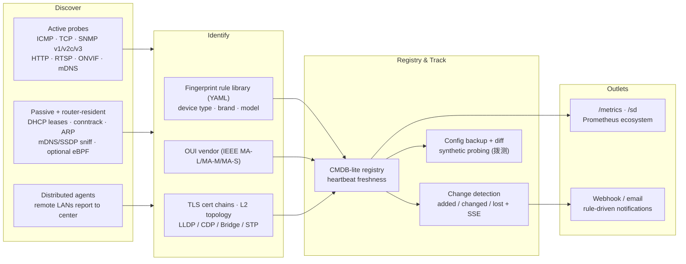
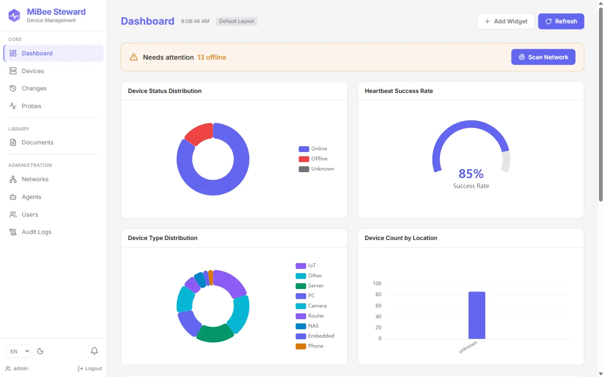
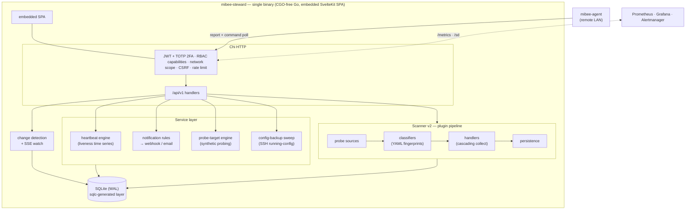

# MiBee Steward

[](https://github.com/Mi-Bee-Studio/MiBeeSteward/actions/workflows/ci.yml)
[](https://pkg.go.dev/mibee-steward)
[](https://goreportcard.com/report/github.com/Mi-Bee-Studio/MiBeeSteward)
[](https://go.dev)
[](https://www.gnu.org/licenses/agpl-3.0)
[](https://github.com/Mi-Bee-Studio/MiBeeSteward/discussions)
[](https://svelte.dev)

**English** | [中文](README.zh-CN.md)

**Device/network-layer asset discovery, identification, and registry** — CMDB-lite for network and IoT assets. Automatically discovers what's on your network, infers what it is (brand/model via protocol fingerprints), and tracks it over time. Single zero-dependency binary; asset state flows to Prometheus via `/metrics` + `/sd`. Alerting/visualization are intentionally left to Alertmanager/Grafana. Built with Go + SvelteKit.






> A full visual walkthrough lives in the [Web UI Tour](docs/en/web-ui.md).

## Features

- **Device Management**: Add, configure, and monitor network devices
- **Multi-Protocol Probing**: SNMP **v1/v2c/v3 (USM authNoPriv/authPriv, encrypted credential vault)**, ICMP, TCP, and HTTP monitoring
- **Device Systems Management**: Each device can have multiple installed systems with entry URLs, displayed as card grid UI with category badges
- **Network Scanner (v2)**: Plugin-based 5-layer architecture (probe → classify → handler → persist → orchestrate) with cascading deep collection. Detects SSH/HTTP/RTSP/ONVIF/SNMP/Prometheus/node_exporter and infers device type/brand (e.g. cameras from RTSP+ONVIF). Extensible: add a protocol by registering one classifier + one handler.
- **Device Config Backup**: Oxidized/RANCID-style scheduled SSH `running-config` pulls (vendor command matrix, host-key TOFU), versioned storage, two-version unified diffs, and `device_config_changed` change events — opt-in, credentials encrypted at rest. [API Reference](docs/en/api.md)
- **RBAC with Network Scoping**: Capability-based roles (admin / operator / viewer) plus per-user network grants; `closed` mode isolates tenants to their granted networks (MSP-ready).
- **MAC Vendor Inference**: Resolves each discovered MAC to its IEEE-registered vendor (MA-L / MA-M / MA-S registries) via longest-prefix match, recorded as `oui_prefix` + `oui_vendor` (the NIC silicon vendor, distinct from the device's self-declared brand). Ships with an embedded curated vendor table for out-of-box coverage; the full IEEE set is an optional download.
- **TLS Certificate Inventory**: Collects the full certificate chain (leaf + issuers) from TLS-wrapped services (HTTPS, LDAPS, SMTPS, IMAPS, POP3S, FTPS, IRCS, TelnetS) — Subject/Issuer/SAN/validity/signature/key/fingerprint + PEM, per port per device, with expiry status (valid/expiring/expired) and a trust verdict surfaced in the device detail UI. Retained in `host_tls_certs` (default 30d).
- **Synthetic Probing**: Blackbox-style probing of explicitly configured external endpoints (public HTTPS sites, hosted TLS ports) on fixed intervals — http/tls/tcp/icmp modules with latency and status-code tracking; `tls` and https targets collect the full certificate chain (leaf + issuers, trust verdict, expiry), reusing the internal cert inventory for internet hosts. Exposed as `mibee_probe_up` / `mibee_probe_cert_expiry_timestamp_seconds` for Prometheus alerting, with example alert rules included.
- **eBPF Passive Observer**: Optional TC ingress program sniffs ONVIF WS-Discovery multicast + TCP magic bytes as a corroborating evidence source (build-tag gated; default build is dependency-free).
- **Distributed Discovery**: Deploy lightweight agents on remote LANs to discover devices across networks. Agents report to a central hub via pull-model HTTPS with bearer-token auth, disconnect recovery, and MAC-primary device identity (same device stays one asset across networks). [Distributed Guide](docs/en/distributed.md)
- **Change Detection**: Automatic device_added / device_changed / device_lost / device_config_changed detection on every scan, with a grace period to prevent jitter-induced false alarms. Queryable history (`GET /changes`) and real-time SSE stream (`GET /changes/watch`).
- **Event Notifications**: Rule-driven routing of change events (device lost/recovered/added/changed, config changed) to webhook/email channels with anti-flap cooldowns — device-lost emails without running an Alertmanager stack.
- **Topology Discovery**: Bridge-MIB SNMP probe walks switch forwarding databases to learn L2 adjacency (which MAC is behind which port). [Architecture](docs/en/architecture.md#distributed-model)
- **Heartbeat Monitoring**: Configurable intervals with automatic failure detection; liveness kept as a time series (online/offline history, offline-since, availability ratio)
- **Prometheus Integration**: Metrics endpoint at `/metrics` for monitoring, HTTP SD at `/sd` for auto-discovery
- **Embedded Web Interface**: SvelteKit SPA with real-time dashboards, multi-LAN device filtering, change history, and agent management UI
- **JWT Authentication**: TOTP 2FA, capability-based RBAC (admin / operator / viewer) with object-level network scoping, and machine-to-machine agent token auth
- **Multi-Language Support**: English and Chinese with @inlang/paraglide-js
- **Audit Logging**: Comprehensive action tracking
- **Single Binary Deployment**: Frontend embedded via go:embed

## Tech Stack

### Backend
- **Go 1.26+** with Chi v5 web framework
- **SQLite** via modernc.org/sqlite (CGO_ENABLED=0)
- **sqlc** for type-safe database queries
- **koanf/v2** for configuration management
- **JWT authentication** with go-chi/jwtauth

### Frontend
- **SvelteKit 5** with file-based routing
- **Tailwind 4** for styling
- **ECharts** for data visualization
- **@inlang/paraglide-js** for internationalization

### Infrastructure
- **Prometheus metrics** integration
- **Systemd** service deployment
- **Nginx** reverse proxy with TLS
- **Docker** containerization support

## Quick Start

### Development
```bash
# Clone the repository
git clone https://github.com/Mi-Bee-Studio/MiBeeSteward.git
cd mibee-steward

# Install frontend dependencies
cd web && npm install
cd ..

# Start development server
make dev
```

### Production Build
```bash
# Build for production
make build

# Cross-compile for multiple platforms
make build-all
```

### Reset admin password

If you lose the admin password, reset it with the CLI subcommand:

```bash
# Interactive (prompts for password)
./mibee-steward reset-admin-password -config configs/config.yaml

# Non-interactive (password via flag or env)
./mibee-steward reset-admin-password -config configs/config.yaml -password 'newpass'
MIBEE_RESET_PASSWORD=newpass ./mibee-steward reset-admin-password -config configs/config.yaml
```

Check the build version:
```bash
./mibee-steward -version
```

### First Run
1. The application creates a SQLite database at `./data/mibee.db`
2. Set a strong admin password via `auth.initial_admin_password` in your config (required for production)
3. **Important**: Never use a default or weak password in production

## Documentation

Full bilingual manuals (English + [中文](docs/zh/introduction.md)) live in `docs/`:

- [Introduction](docs/en/introduction.md) — Project overview and features
- [Quick Start](docs/en/quick-start.md) — Get running in 5 minutes
- [Architecture](docs/en/architecture.md) — System design and data flow
- [API Reference](docs/en/api.md) — REST API documentation
- [Configuration](docs/en/configuration.md) — Configuration reference
- [Deployment](docs/en/deployment.md) — Production deployment guide (systemd / nginx / Docker / OpenWrt)
- [Distributed Guide](docs/en/distributed.md) — Center + agent model for multi-network discovery
- [Integrations](docs/en/integrations.md) — Grafana dashboards, notification channels (Feishu/WeCom/Telegram/Discord), n8n & Home Assistant
- [Discovery Guide](docs/en/discovery.md) — Probe sources and identification pipeline
- [Product Scope](docs/en/product-scope.md) — What it is / is not, and where it fits
- [Fingerprint Spec](docs/en/fingerprint-spec.md) — Contributing identification rules (YAML)
- [Development Guide](docs/en/development.md) — Contributing and coding conventions

## Configuration

The application uses YAML configuration files with environment variable overrides. See `configs/config.example.yaml` for all available options:

```yaml
server:
  port: 8080
  host: 0.0.0.0

database:
  path: ./data/mibee.db

metrics:
  enabled: true
  path: /metrics
```

Environment variables prefixed with `MIBEE_` override configuration values.

## Architecture



```text
├── cmd/server/           # Center entry point (+ reset-admin-password subcommand)
├── cmd/agent/            # Distributed discovery agent for remote LANs
├── internal/
│   ├── api/              # Chi HTTP: handlers, middleware, routes
│   ├── authz/            # Network-scope authorization (scopeql + scoperesolver)
│   ├── changedetect/     # change_log + in-process Watcher (SSE)
│   ├── config/           # koanf configuration loading
│   ├── db/               # sqlc-generated data layer (from db/schema.sql)
│   ├── domain/           # DTOs + shared types
│   ├── metrics/          # Prometheus collectors
│   └── service/          # Business logic: scannerv2 engine, heartbeat, probes,
│                          #   notifications, config backup, …
├── web/                  # SvelteKit 5 SPA (embedded via go:embed)
└── deploy/               # systemd, nginx, Docker, OpenWrt, Prometheus alerts
```

## Testing

```bash
# Run all tests
go test ./...

# Run integration tests
make test
```

## Security Notes

- Never edit `internal/db/*.go` files - they are sqlc-generated
- Use `.env` files for secrets, never commit them
- SQLite uses WAL mode for better performance
- All functional testing must be done on the test server (your-test-server)

## Contributing

1. Fork the repository
2. Create a feature branch
3. Make your changes
4. Add tests for new functionality
5. Run `make test` to ensure everything works
6. Submit a pull request

## License

MiBee Steward is licensed under the [GNU AGPLv3](https://www.gnu.org/licenses/agpl-3.0), with a [commercial license](LICENSE-COMMERCIAL.md) available for closed-source derivatives or SaaS use without open-sourcing modifications. The fingerprint corpus (`configs/fingerprints/`) is licensed under [CC-BY-SA 4.0](https://creativecommons.org/licenses/by-sa/4.0/). See [LICENSE](LICENSE) and [NOTICE](NOTICE) for details.

## Support

For support, please open an issue in the GitHub repository or contact the development team.