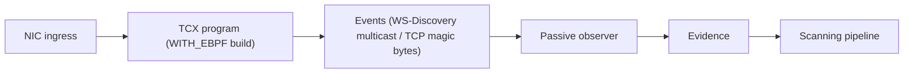

# eBPF Passive Observer

## Overview

MiBee Steward's scanning engine (scannerv2) uses a **dual-probe architecture**: active probing (TCP/SNMP/ONVIF etc.) provides precise identification, while passive observation collects supplementary evidence from real traffic without sending any probe packets. The eBPF passive observer implements the latter: it attaches to the Linux kernel's TCX ingress hook to passively inspect inbound packets on network interfaces, matching known protocol signatures and feeding evidence to the classifier layer for fusion.

> **Positioning**: The eBPF observer is a **corroborating signal**, not a replacement for active probing. ONVIF/WS-Discovery multicast announcements are the cleanest passive target; TCP protocols (SSH/RTSP/HTTP) are more reliably detected by active probing, and the eBPF match results are injected as corroborating evidence with confidence 0.6.

## How It Works

`tc_ingress.c` attaches to the TCX ingress hook on network interfaces and inspects incoming packets for known protocol signatures. The full packet path:



| Signature | Evidence kind | Classified as |
|-----------|--------------|---------------|
| TCP payload `SSH-...` | `banner` | ssh |
| TCP payload `RTSP/1...` | `rtsp_banner` | rtsp |
| TCP payload `HTTP/1...` | `banner` | http |
| UDP/3702 ↔ 239.255.255.250 | `wsdiscovery` | onvif |
| UDP/67-68 DHCP | `dhcp` (vendor class / parameter request list / message type, #496/#508) | dhcp |
| TCP ClientHello | `tls_sni` (SNI hostname) | https |
| UDP/5353 mDNS query | `mdns` (first query name) | mdns |
| UDP/1900 SSDP | `ssdp` (presence) | ssdp |
| ARP (any op) | `arp_sighting` → discovery channel (#497) | — (presence, not evidence) |
| IPv6 NS/NA/RS | `nd_sighting` → discovery channel (#497) | — (presence, not evidence) |

Matches are emitted to a ring buffer (`events` map) and consumed by the Go loader, which translates them into `scannerv2.Evidence` with `Source: "passive:ebpf:tc"`. Presence/banner matches carry `Confidence: 0.6`; identity-bearing signatures carry more: DHCP 0.8 (vendor class + parameter-request list drive the DHCP fingerprint rules), TLS SNI 0.7. The classifier layer fuses this corroborating signal with active-probe evidence to produce the final identification.

**Key property**: The program **never modifies or drops packets**; it is pure observation (`TC_ACT_UNSPEC`). On a bridge, attach the **physical ports** (`eth0`, `eth1`, ...), not the bridge device: frames forwarded between bridge ports do not traverse the bridge device's own TC hook.

## ARP / ND Passive Presence (#497)

Beyond service signatures, the observer captures **wire-level presence**: ARP sender pairs (IP+MAC) and IPv6 NS/NA/RS speakers. These are facts about the network, not service evidence — they enter through the **discovery channel** (`source=passive:ebpf:arp`), joining the same dedup/known-host/identify funnel as the other discovery sources. This is the third capture path for sleeping devices (after active scanning and DHCP leases): hosts that answer nothing and renew no lease still speak ARP.

Mechanics worth knowing:

- **Throttling is in the BPF program itself**: an LRU map allows one sighting per (sender IP, MAC, kind) per ~30s bucket. A gratuitous-ARP storm (1000 frames verified on the rig) produces exactly one event; the ring buffer never sees the rest. The map is LRU-capped at 8192 entries, so memory is bounded and a re-sighting after eviction simply re-emits.
- **DAD probes (sender 0.0.0.0) are filtered in BPF** — they carry no identity.
- **ND sightings are MAC-keyed**: the sender's IPv6 is decoded and kept, but discovery is IPv4-keyed today, so they wait for the MAC-keyed channel (#522).
- **Bridge boxes get the most value**: attach the physical ports — bridged frames do not traverse the bridge device's TC hook (see the notes on `scanner.ebpf.interfaces`).

## Build Story

eBPF support is controlled by a build tag. The default build ships with **zero kernel dependencies**:

```bash
# Default build, no eBPF (no-op stub):
make build

# Build with eBPF support (requires ONLY clang >= 14, on any host OS):
make build-with-ebpf
```

- **Default build**: uses the no-op stub at `internal/service/scannerv2/ebpf/observer_stub.go` with zero kernel/toolchain dependencies
- **eBPF build**: two steps. First generate the bpf2go bindings — this invokes `cilium/ebpf`'s bpf2go to compile `tc_ingress.c` (the program is **CO-RE free**: it uses only stable UAPI types via `bpf/bpf_standalone.h`, so no bpftool, no kernel BTF, and no libbpf headers are needed at build time). The generated files (`tcingress_*.go/.o`, note the lowercase stem) are gitignored build artifacts. Then `make build-with-ebpf` builds with `-tags WITH_EBPF`; the BPF object is embedded into the final binary

```bash
# Step 1: generate bpf2go bindings (clang only; outputs are not committed).
# The generator lives in a WITH_EBPF-tagged file, so the tag is required:
go generate -tags WITH_EBPF ./internal/service/scannerv2/ebpf/

# Step 2: build
make build-with-ebpf
```

Because the object contains **no CO-RE relocations**, it loads on kernels **without BTF** as well — the build is fully portable and so is the artifact.

## Runtime Requirements

Only the `WITH_EBPF` build requires:

| Requirement | Details |
|-------------|---------|
| **Kernel** | Linux ≥ 6.6 (the loader attaches via TCX; BTF is **optional** — the program is CO-RE free) |
| **Privileges** | root, or ambient `CAP_BPF` + `CAP_NET_ADMIN` (see `deploy/mibee-steward-ebpf-dropin.example.conf`) |
| **Config** | `scanner.ebpf.enabled: true`; `scanner.ebpf.interfaces` empty = all non-loopback, up interfaces |

Verified live on the arm64 rig (kernel 6.18.44, Armbian) running as root: the observer attaches, goes `active`, and real LAN traffic (SSH/HTTP banners, SSDP beacons, mDNS) plus injected DHCP/mDNS/SSDP frames land as `passive:ebpf:tc` evidence rows with clean field extraction (DHCP vendor class, parameter-request list, message type; mDNS query name) — the DHCP fingerprint rules then drive device brand inference from passive evidence alone. Also verified on kernel 6.18 (WSL2 x86-64) and kernel 6.6 class (OpenWrt 24.10 target).

**Ambient-caps caveat (kernel-dependent)**: the documented systemd drop-in shape (non-root user + ambient `CAP_BPF`/`CAP_NET_ADMIN`) loads on many kernels, but on some — observed on the same 6.18.44 sunxi box — the loader rejects the program at load with `EFAULT` even though the identical binary loads and runs as root on the same host. This is a kernel loader/verifier quirk with bounded loops under ambient caps, not a program bug; when it fires, the observer reports `failed` with the reason and the server keeps running and scanning normally (#493 degradation). If your drop-in shape reports this, run that vantage's center process as root. The program stays deliberately free of variable-offset packet-pointer arithmetic (helper-based reads): with such arithmetic the verifier rejects the load under ambient caps with a non-root euid on these kernels, while root loads either way.

## Degradation & Observability

The degradation rule: **an eBPF problem may silence the observer, it never crashes the server and never blocks active scanning** (#493). The observer evaluates prerequisites before touching the kernel and reports its lifecycle through a state machine:

| State | Meaning | Example |
|-------|---------|---------|
| `active` | fully operational | attached on all interfaces |
| `degraded` | running with reduced capability | attached 1/2 interfaces; ring-buffer reader tripped its error breaker |
| `unsupported` | prerequisites missing, nothing was loaded | kernel < 6.6; missing `CAP_BPF`/`CAP_NET_ADMIN` (names the missing caps) |
| `failed` | a start attempt failed | program load/verification error (full reason in the log) |
| `pending` | enabled, lazy start has not run yet | the observer starts on the first probe of the first scan |
| `disabled` / `not-built` | turned off / binary lacks the WITH_EBPF tag | — |

Every transition logs once (`active` at info, degradations at warn with an actionable reason). The ring-buffer drain has an error breaker: after 100 consecutive read errors it stops and degrades instead of spinning.

`mibee-steward doctor` evaluates the prerequisites proactively — before any scan — so you can answer "would eBPF work on this host" without starting anything:

```text
✅ ebpf observer    kernel=6.6.144 btf=true caps=ok
❌ ebpf observer    missing privileges: CAP_NET_ADMIN, CAP_BPF (run as root, or grant ambient caps — see docs/en/ebpf.md)
   ❌ hint: grant ambient caps via a systemd drop-in — see deploy/mibee-steward-ebpf-dropin.example.conf
```

## Configuration

Enable in the YAML config file:

```yaml
scanner:
  ebpf:
    enabled: true
    interfaces:
      - eth0
      - eth1
```

- `scanner.ebpf.enabled`: enable the eBPF passive observer (default `false`)
- `scanner.ebpf.interfaces`: interfaces to attach; **empty = every non-loopback, up interface**. On a gateway prefer an explicit list to keep the observation surface predictable; on a bridge list the physical ports

See [Configuration](configuration.md) for all config options, and [Discovery](discovery.md) for discovery-related settings.

## When to Use

### Use eBPF passive observation when

- Running on a gateway/router that sees all inbound traffic
- Need to discover hosts that don't respond to active probes (sleeping IoT, firewalled hosts)
- Detecting ONVIF cameras via multicast announcements (cleanest passive target)
- Want supplementary evidence without increasing network traffic

### Active probing suffices when

- All network devices respond to SNMP/ICMP probes
- Runtime environment doesn't meet eBPF requirements (kernel < 6.6, no privileges)
- Container/virtualized environment can't obtain `CAP_BPF` privileges

## Known Limitations

- **Linux only**, kernel ≥ 6.6 (TCX attach); BTF optional (CO-RE-free program)
- **Privileges required**: root or ambient `CAP_BPF` + `CAP_NET_ADMIN`; unprivileged BPF is disabled by default on modern kernels
- **TCP signals are corroborating only**: SSH/RTSP/HTTP matches are evidence at confidence 0.6, not replacements for active probing
- **No CGO dependency**: the default build is completely free of eBPF code, suitable for all deployment environments
- **On a bridge, attach physical ports**: bridged frames do not traverse the bridge device's own TC hook

## Iterating on the C Program

```bash
cd bpf && make tc_ingress.o
```

Requires `clang` (≥ 14) only — any host OS. The program is CO-RE free by construction (`bpf/bpf_standalone.h` provides the UAPI types and the helper declarations in cilium/ebpf's static-pointer style); do **not** introduce accesses to kernel-internal types, that would silently reintroduce the BTF/CO-RE dependency. Keep the verifier bounds checks complete: every packet field read must be covered by a preceding bounds check that spans the full struct (the TCP header check guards the `doff` bitfield container at offset 12 — an 8-byte window is not enough).

## Related Pages

- [Discovery](discovery.md), full list of discovery sources and configuration
- [Configuration](configuration.md), all configuration options
- [Architecture](architecture.md), scanning engine overview
