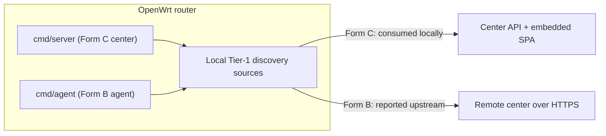

# OpenWrt Router Deployment

MiBee Steward can run directly on an OpenWrt router, in two forms: a **router-agent** (a light agent on the router reporting upstream to a remote center, repo naming **Form B**) and a **router-center** (the full center runs ON the router, repo naming **Form C**; Form A means a center on a generic host, see [Standalone Deployment](deployment.md)).

> Verified in the field on a GL.iNet MT2500 (Brume 2, mt7981): form C ran end-to-end on the stock firmware, all 4 Tier-1 sources produced live data, and a full-subnet scan self-identified the router as a GL.iNet device (#288). Read the known-limitation entry about v4 listeners on this firmware (troubleshooting table below) before deploying.

## Why Run on a Router

The router is the network's **choke point**, it sees DHCP leases, NAT flows, WiFi associations, and DNS queries that a regular LAN host cannot. These four Tier-1 router-only discovery sources are only available on the gateway:

| Source | What it gives | Router daemon it reads | No-op when absent |
|---|---|---|---|
| `dhcp_leases` | Authoritative hostname↔MAC↔IP map | dnsmasq `/tmp/dhcp.leases` | ✅ clean no-op (non-DHCP host) |
| `conntrack` | "Who is talking RIGHT NOW" (liveness + discovery) | `/proc/net/nf_conntrack` | ✅ clean no-op (module not loaded) |
| `hostapd` | WiFi STA associations (signal dBm / SSID / connect time) | hostapd ctrl socket → `iw station dump` fallback | ✅ clean no-op (no WiFi / no hostapd) |
| `dns_log` | Passive DNS fingerprint (devices that block probes still do DNS) | dnsmasq `--log-queries` log file | ✅ clean no-op (no query logging configured) |

On a host that lacks the backing file/socket, the sources degrade to a clean no-op (debug log + skip), no errors, no crashes. Configuration lives under `scanner.discovery.*` (see [Discovery](discovery.md) and [Configuration Reference](configuration.md)).

**One-click enablement (#360)**: the config generated by `install.sh` on first install turns the three zero-cost router-resident sources ON by default (`dhcp_leases` + `conntrack` + `hostapd`, free when the host IS the gateway), and LuCI's Services → MiBee Steward → Settings page offers all four as checkboxes (save = restart + health check). `dns_log` stays off by default, it additionally requires dnsmasq query logging (`uci set dhcp.@dnsmasq[0].logqueries=1 && uci commit dhcp && /etc/init.d/dnsmasq restart`, shown on the page); the LuCI toggle notes this. Manual deployments and config-preserving upgrades are unaffected (existing settings kept, installer prints a hint).

## Form Selection

| Form | Binary | Role | When to use |
|---|---|---|---|
| **Form B, router-agent → remote center** | `cmd/agent` | Pure sensor: scans the router's LAN, reports upstream over HTTPS to a center elsewhere | Multi-site / multi-LAN: one remote center + one agent per router. The agent is light (18MB binary, ~100MB RAM). |
| **Form C, router-center** | `cmd/server` | The full center (API + SPA + asset registry + discovery) running ON the router | Single-network (home / small office): one router does everything, gets the choke-point signals AND serves the management UI. No separate agent process needed. |

Form B pairs with [Distributed Deployment](distributed.md); Form C is a self-contained single-network option (compare with [Standalone Deployment](deployment.md)).



## Installation

### Hardware Requirements

| Resource | Minimum | Comfortable | Notes |
|---|---|---|---|
| **Architecture** | **ARM or ARM64** | ARM64 (GL.iNet MT3000, ipq807x, mt798x; NanoPi R5S-class iStoreOS boxes) | **MIPS is NOT supported**, `modernc.org/libc` (the pure-Go SQLite backend's transitive dep) has no working `mips`/`mipsle` port and a broken `mips64le` one. This excludes older ath79/ramips routers (TP-Link Archer C7, Netgear R7000, etc.). |
| **RAM** | 128 MB | 256 MB+ | modernc SQLite is memory-heavier than C-SQLite; the center is heavier than the agent. |
| **Flash** | 32 MB | 128 MB+ | Binary 16-18MB + OUI (~5MB full / 1.2KB curated) + fingerprint corpus (~1.2MB) + DB. The DB should live on `/tmp` (tmpfs), see Resource Usage below. |

### Cross-Compile

Both binaries build CGO-free (`modernc.org/sqlite`), so a plain `GOOS`/`GOARCH` cross-compile works, no OpenWrt SDK needed:

```bash
# Form B: agent
CGO_ENABLED=0 GOOS=linux GOARCH=arm64 go build \
  -trimpath -ldflags="-s -w" -o mibee-agent ./cmd/agent/
# → ~18MB

# Form C: center
CGO_ENABLED=0 GOOS=linux GOARCH=arm64 go build \
  -trimpath -ldflags="-s -w" -o mibee-steward ./cmd/server/
# → ~24MB (includes the embedded SvelteKit SPA)
```

`GOARCH=arm` (32-bit, GOARM=7) also works for older ARM boards; `GOARCH=mips*` does **not**. Note: the repo's Makefile cross-compile targets (`make build-linux-arm64` etc.) build the **center** binary; the agent has matching `make build-agent-linux-arm64` / `-amd64` / `-arm` targets (both sets run the device-type sync the embed step needs). A bare `make build-agent` builds for the **host** architecture:

```bash
# Center (Form C), Makefile targets (amd64 / arm64 / arm likewise):
make build-linux-arm64

# Agent (Form B), native arch:
make build-agent
```

### procd Init Scripts & Config Files

The repo ships two procd init scripts, `deploy/openwrt/mibee-steward.init` and `deploy/openwrt/mibee-agent.init`, installed to `/etc/init.d/` and managed with `enable` (start at boot) and `start`/`stop`/`restart`. Config files live under `/etc/mibee/`.

**Install Form B (agent → remote center):**

```bash
# On your build host:
scp mibee-agent root@router:/usr/bin/mibee-agent
scp deploy/openwrt/mibee-agent.init root@router:/etc/init.d/mibee-agent
ssh root@router 'mkdir -p /etc/mibee'
scp <your-agent.yaml> root@router:/etc/mibee/agent.yaml   # write it from the minimal sample in [Distributed Deployment](distributed.md) (the repo ships no ready-made file), then edit on the router

# On the router, edit /etc/mibee/agent.yaml:
#   center.url:         http://<your-center-ip>:<port>
#   center.auth_token:  <minted on the center via POST /api/v1/agents/tokens>
#   network.name/cidr:  this router's LAN (e.g. lan-62 / 192.168.62.0/24)
#   scanner.discovery.*: enable the router-only sources you want
#     (dhcp_leases, conntrack, hostapd, dns_log, all default false)

ssh root@router '/etc/init.d/mibee-agent enable && /etc/init.d/mibee-agent start'
ssh root@router 'logread -e mibee-agent | tail -20'   # expect "mibee-agent running"
```

**Install Form C (center on the router):**

```bash
scp mibee-steward root@router:/usr/bin/mibee-steward
scp deploy/openwrt/mibee-steward.init root@router:/etc/init.d/mibee-steward
ssh root@router 'mkdir -p /etc/mibee'
scp configs/config.yaml root@router:/etc/mibee/config.yaml   # then edit on the router

# On the router, edit /etc/mibee/config.yaml:
#   server.port:                   e.g. 8080
#   auth.jwt_secret:               a ≥32-char random string (required)
#   auth.initial_admin_password:   empty = create the admin password in the browser on first run (recommended)
#   network.name/cidr:             this router's LAN
#   database.sqlite.path:          /tmp/mibee/mibee.db  (tmpfs, see below)
#   scanner.discovery.*:           enable the router-only sources

ssh root@router '/etc/init.d/mibee-steward enable && /etc/init.d/mibee-steward start'
# Browse to http://<router-ip>:8080, the first run walks you through CREATING the admin password
```

### iStoreOS / NanoPi R5S: one-command install (no Docker)

iStoreOS is an OpenWrt-based community firmware, everything on this page applies. A NanoPi R5S (RK3568, **arm64**, 1-4GB RAM + 8-32GB eMMC) is far above the minimums above and comfortably runs **Form C** (the full center); iStoreOS's bundled Docker is NOT needed.

A common concern, "where does the frontend render?", is a non-issue: the SPA is compiled into the Go binary and the router only serves HTTP. Browse to `http://<router-ip>:8080` from any device on the LAN; the router itself needs no display or frontend runtime. The MT2500 "v4 listeners never handshake" row in the troubleshooting table is a GL.iNet vendor-kernel bug, unrelated to iStoreOS.

```bash
# On your build host (GOARCH defaults to arm64; add GOARCH=arm for ARMv7 boards):
make package-openwrt
#    → bin/mibee-steward-openwrt-arm64-<version>.tar.gz

scp bin/mibee-steward-openwrt-arm64-*.tar.gz root@<router-ip>:/tmp/
ssh root@<router-ip> 'cd /tmp && tar -xzf mibee-steward-openwrt-arm64-*.tar.gz && ./install.sh'
```

On the router, `install.sh` verifies the architecture (rejects MIPS, smoke-executes the binary), installs the binary to `/usr/bin` and the procd script to `/etc/init.d`,, **on first install only**, generates `/etc/mibee/config.yaml` (random `jwt_secret`, `cookie_secure` forced to false (plain-HTTP LAN), EMPTY initial admin password, `network.name/cidr` derived from `uci`, DB at the absolute path `/etc/mibee/data/mibee.db`), opens + persists `ping_group_range`, then enables, starts, and health-checks the service. An existing `config.yaml` is left untouched, **re-running with a fresh tarball is the upgrade path**. Open the printed URL in a browser, the first-run screen asks you to **create** the admin password (nothing to copy from the install output, no SSH needed). Afterwards:

- If the password is ever lost: `/usr/bin/mibee-steward reset-admin-password -config /etc/mibee/config.yaml`;
- Enable the router-only discovery sources you want (`scanner.discovery.*`; the R5S has no onboard WiFi, so `hostapd` no-ops by design);
- With roomy eMMC the DB defaults to flash (the portrait survives reboots); write-sensitive setups can point it at `/tmp/mibee/mibee.db` (tmpfs, rebuilt after reboot, see "Flash-Wear Mitigation" above).

iStoreOS notes: LuCI/the iStore admin UI hold ports 80/443, MiBee's default 8080 doesn't conflict; the default LAN is usually `192.168.100.1/24` (check `uci get network.lan.ipaddr`); `dhcp_leases` / `conntrack` / `dns_log` read the same standard OpenWrt paths, no extra adaptation needed.

### System package (.ipk / .apk)

If you prefer the system package manager (install/upgrade/remove via the package manager, auto-generated config, data dir survives removal), deliver a package instead of the tarball. **OpenWrt 24.10 replaced opkg with apk, and the package format went from .ipk to .apk**, iStoreOS builds exist on both bases, so check which one your firmware uses first:

```bash
ssh root@<router-ip> 'command -v opkg apk; grep DISTRIB_RELEASE /etc/openwrt_release'
```

```bash
# opkg (OpenWrt 22.03/23.05 base, most current iStoreOS builds):
make package-openwrt-ipk     # → bin/mibee-steward_<version>_arm64.ipk
scp bin/mibee-steward_*_arm64.ipk root@<router-ip>:/tmp/
ssh root@<router-ip> 'opkg install /tmp/mibee-steward_*_arm64.ipk'

# apk (OpenWrt 24.10+ base):
make package-openwrt-apk     # → bin/mibee-steward_<version>_arm64.apk
scp bin/mibee-steward_*_arm64.apk root@<router-ip>:/tmp/
ssh root@<router-ip> 'apk add --allow-untrusted /tmp/mibee-steward_*_arm64.apk'
```

The two packages' lifecycle scripts are equivalent: `pre-install`/`preinst` gates on `uname` (a mismatched box is refused before anything is laid down); `post-install`/`postinst` runs the exact same configure logic as the tarball installer (generates `/etc/mibee/config.yaml`, opens `ping_group_range`, enables + starts + health-checks, no admin password is pre-generated; it is created in the browser on first run); upgrade = install the new package (`opkg install` the new .ipk / `apk add` the new .apk, config kept, service restarted); remove = `opkg remove mibee-steward` / `apk del mibee-steward` (**`/etc/mibee` config + database are deliberately kept**, delete manually for a full wipe).

Why `Architecture: all`: the payload is a CGO-free static binary, so instead of chasing OpenWrt's per-target arch-name zoo (`aarch64_generic`, `aarch64_cortex-a53`, `arm_cortex-a7_neon-vfpv4`, …), the real gates are the pre-script uname check + the post-script `-version` smoke run. Exact arch naming and feed publishing remain the buildroot follow-up (see "Not Covered Here" below). The tarball path stays available for package-manager-less environments.

### LuCI native entry (iStoreOS / OpenWrt web admin)

The package also lays down a **LuCI integration** (classic Lua controller + templates; no luci-compat/CBI dependency, the files are inert on builds without LuCI). After install, the router's admin UI (**MiBee Steward** under System → Services) offers two pages:

- **Status**: service state, health, autostart, version, listening port, database size, and an "Open UI" button straight into the full web UI (`http://<lan-ip>:<port>`).
- **Settings**:
  - **Web UI port**: rewrites `server.port`, restarts, and health-checks the new port (80/443 are refused, LuCI owns them);
  - **Admin password**: sets the admin login directly (via `reset-admin-password`, validated against the effective password policy, min 8 + upper + lower + digit; handed over through a 0600 temp file, never a command line);
  - **Autostart** toggle and **Restart**.

Every privileged operation funnels through the single audited script `/usr/lib/mibee/luci-helper.sh` (the LuCI pages only validate input and delegate); it is callable standalone: `luci-helper.sh status | set-port <N> | set-password <file> | set-enabled <0|1> | restart`. Asset-level configuration (discovery sources, scanner tuning, notifications) stays in MiBee's own web UI, the LuCI entry covers router-level concerns only.

### UCI Configuration (for the dns_log source)

`dns_log` requires dnsmasq query logging:

```bash
uci set dhcp.@dnsmasq[0].logqueries=1 && uci commit && /etc/init.d/dnsmasq restart
```

Then point `scanner.discovery.dns_log.path` at the resulting log (or leave it empty to probe the conventional paths).

## Permissions (CAP_NET_RAW)

Some of MiBee Steward's probes rely on raw sockets and need **CAP_NET_RAW**:

- ARP probing (`arp_scan` etc.) sends/receives raw ARP frames
- ICMP active probing depends on raw sockets
- If you bake in the raw-frame LLDP listeners or the [eBPF passive observer](ebpf.md), matching runtime caps are needed too (eBPF needs `CAP_BPF` + `CAP_NET_ADMIN`, kernel ≥5.8 + BTF)

**The procd init scripts run as root by default** (standard OpenWrt practice), so these capabilities are naturally available. If you run under a restricted account or a seccomp/apparmor policy that drops `CAP_NET_RAW`, ARP probing (`arp_scan` etc.) degrades or fails, and MAC discovery plus ICMP liveness checks become unavailable.

## Resource Usage

| Resource | Form B (agent) | Form C (center) |
|---|---|---|
| **Binary size** | ~18MB | ~24MB (includes SPA) |
| **RAM** | ~100MB | Heavier (modernc SQLite + asset registry) |

The agent is very lightweight and fits low-power routers (e.g. GL.iNet series); the center is best on 256MB+ routers.

### Flash-Wear Mitigation (DB on tmpfs)

Both binaries write a SQLite DB (WAL mode). On a router's NAND flash under overlayfs this causes write-wear. **Point the DB at `/tmp` (tmpfs, RAM-backed):**

- **Form B (agent):** the local DB is explicitly a *shadow* (the center is the writer of record), so cold-start loss is fine. Note the agent's DB path currently has **no dedicated config key**, it is fixed to `agent.db` next to the config file (e.g. `/etc/mibee/agent.db`). Its write volume is tiny (scan-result staging only), so flash is usually fine; if you truly need it on tmpfs, move the whole config dir to `/tmp/mibee-agent/` and point the init script there (the config file must be recreated after each reboot). The in-memory pending-queue (100 batches) handles disconnection during a reboot.
- **Form C (center):** the DB is the authoritative portrait. Pointing `database.sqlite.path` at `/tmp` means cold-start loss (rebuilt on the next scan; acceptable for a single-router deployment). For deployments that need persistence across reboots, leave that key on flash and accept the wear, consumer routers live 5-10 years and scan write volume is modest.

## Verification & Troubleshooting

### Health Check

```bash
# Form C (center): health endpoint
curl -s http://localhost:8080/api/v1/health

# View logs
logread -e mibee-steward   # Form C
logread -e mibee-agent     # Form B, expect "mibee-agent running"
```

### Common Issues

| Symptom | Cause / fix |
|---|---|
| `bind: address already in use` on start | Another process holds the port (often the router's own LuCI on 80/443). Set `server.port` to a free port (e.g. 8080). |
| `database is locked (SQLITE_BUSY)` | WAL-mode write contention under heavy concurrent probing. The pool ceiling (16) is currently fixed at compile time; the practical knob is reducing `scanner.max_concurrent_hosts`. |
| `mmap: access denied` at startup | Kernel disallows the mmap SQLite wants, run as root (the procd script does) or check seccomp/apparmor. |
| Discovery sources all no-op | Expected on a non-router host. On a router, check each source's prereq (dnsmasq running, `nf_conntrack` loaded, hostapd ctrl_interface enabled). |
| ICMP probes all `permission denied` | OpenWrt's default `net.ipv4.ping_group_range = 1 0` disables the unprivileged datagram ping sockets MiBee's ICMP probes use. Fix once: `echo 'net.ipv4.ping_group_range = 0 2147483647' > /etc/sysctl.d/99-mibee.conf && /etc/init.d/sysctl restart`, `mibee-steward doctor` checks this. |
| Intermittent silent connection drops to the router's own ports | fw3 SYN-flood protection (default on GL.iNet) is a global 25/s burst-50 token bucket; MiBee's heartbeat port checks + probe fan-out can exhaust it and new TCP connections to ANY local port are silently dropped. Disable SYN-flood protection in LuCI or via fw3 config. |
| New v4 TCP listeners never complete handshakes on GL.iNet MT2500 (mt7981, kernel 5.4.211 SDK) | Vendor-kernel bug: SYNs arrive but SYN-ACKs leave with an unfilled `0.0.0.0` address and get RST'd by peers, affects any new listener in any language, while IPv6 works. Known limitation on this specific firmware: bind v6 (`server.host: "::"`) or run the center elsewhere and put an agent on the router (form B). |
| `scp` to the router fails with `sh: /usr/libexec/sftp-server: not found` | Vendor firmwares (GL.iNet included) ship no sftp-server, so modern scp falls back to SFTP and dies. Force the legacy protocol: `scp -O …`. |
| `dns_log` discovery source stays empty on GL.iNet | GL's dnsmasq build logs queries via the custom `logfacility` uci key (not the standard `logfile`): `uci set dhcp.@dnsmasq[0].logqueries=1 && uci set dhcp.@dnsmasq[0].logfacility=/tmp/dnsmasq.log && uci commit dhcp`, then point `discovery.dns_log.path` at that file and restart dnsmasq. |
| `build constraints exclude all Go files … modernc.org/libc…` at build | The typical error shape for unsupported MIPS (modernc/libc limitation). Use an ARM/ARM64 router. |

### Not Covered Here

- **Official .ipk/.apk packaging** (OpenWrt build feed): this repo now ships **hand-rolled binary packages** (`make package-openwrt-ipk` / `make package-openwrt-apk`, `Architecture: all` + pre-script arch gate, installed locally via `opkg install <file>` / `apk add --allow-untrusted <file>`). What's still missing is the **official packaging** via the OpenWrt buildroot's `golang-package` macros, exact per-target arch naming, signing, and feed publishing so users can subscribe. Not required for correctness.
- **MIPS support**: structural limitation of `modernc/libc`; would require swapping the SQLite backend to bbolt/goleveldb (deferred until a MIPS customer need exists).
