# Scenario Playbooks

Beginner-friendly walkthroughs: a handful of real scenarios, each 5–15 minutes, that teach the product by doing. The only prerequisite — you've deployed MiBee Steward and logged in following the [quick start](quick-start.md).

> Note: screenshots come from a live instance. Your data will differ — discovery results depend on what's actually on your network.

## Scenario 1: See your network for the first time, in 15 minutes

**Goal**: scan a home or office network once and get an inventory with brands/models/types. This is the foundation for everything else.

1. After logging in, go to **Devices → Quick Scan**.
2. Enter your subnet as the target, e.g. `192.168.1.0/24` (a single IP works too).
3. If your devices expose SNMP and the default community `public` doesn't match, enter yours; skip it if you don't use SNMP. Leave the timeout at the default 2s.

   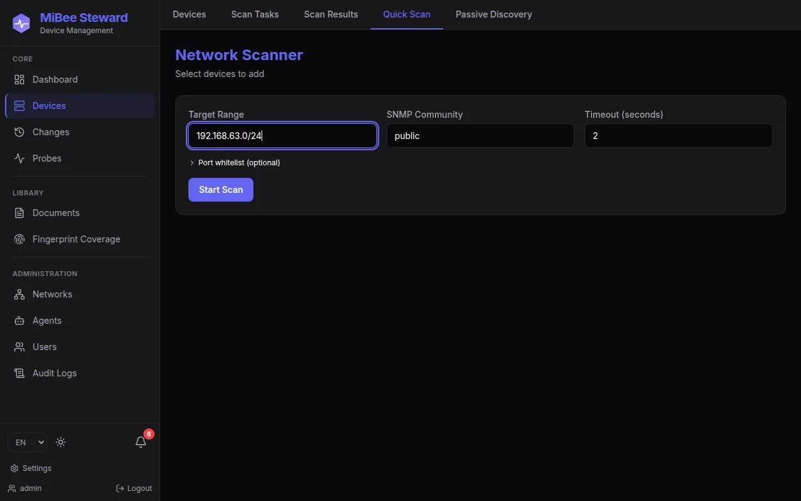

4. Click **Start Scan**. A /24 typically takes from tens of seconds to a few minutes, with live progress on the page.
5. When it finishes, open the **Devices** list — every device shows IP, type, brand, and status. Unidentified devices are still registered as bare IPs; later scans progressively fill in their portraits.

   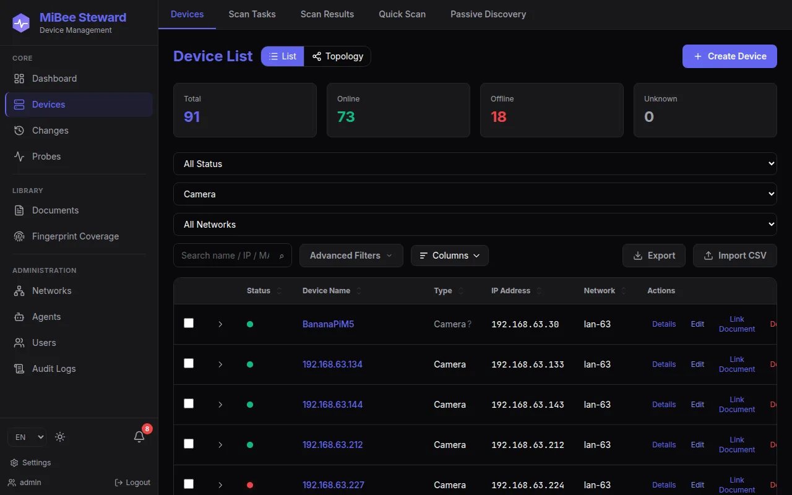

6. Open any device to see the **Overview**: inferred type, brand, model, MAC, serial number, RTSP URL and more, all in one place.

   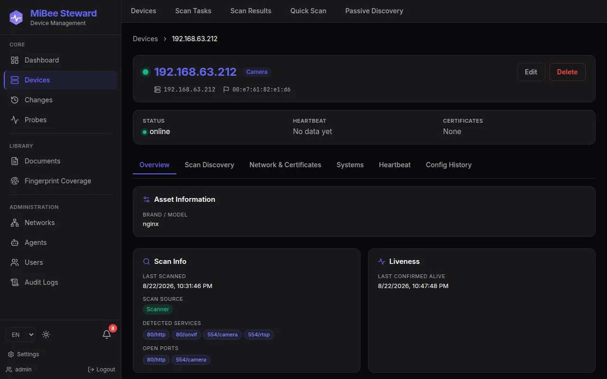

**Where to go next**: schedule [async scan tasks](web-ui.md) to keep the inventory fresh, or continue with scenario 2 and put your network through a security check.

## Scenario 2: Home network audit — who's using my network?

**Goal**: spot unfamiliar devices and get notified the moment something new joins. The most practical playbook for home and small-office use.

1. **Take stock**: walk the Devices list with type filters and search — cameras, routers, NAS, PCs, phones. Pay attention to two kinds of rows:
   - "Blank" devices with no type/brand — open the detail page and check the MAC and OUI vendor (the NIC silicon vendor is a strong clue);
   - Devices whose MAC carries the locally-administered bit flag — common on phones with MAC randomization or some embedded gear; it's neutral observability info.
2. **Read the change history**: open **Changes**, filter by device-added — every device's "arrival time" is on record. Anything you don't recognize shows up here immediately.

   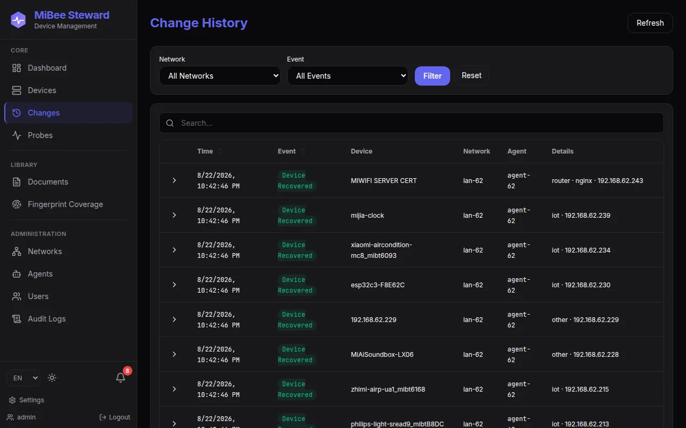

3. **Set up join notifications**: go to **Settings → Notifications**, add a channel first (webhook or email), then create a rule: event type "device added", scope your network, target that channel. From now on every new device lands in your Feishu/Telegram/inbox.
4. **(Optional) Heartbeats on critical devices**: configure probes on the detail page of each device you care about — you'll know when they drop.

**Where to go next**: add "device lost" to the notification rules; wire `/metrics` into Prometheus for 24/7 watch (see the [integrations guide](integrations.md)).

## Scenario 3: An IoT camera fleet dossier

**Goal**: build a dossier for IP cameras (or any IoT fleet): what it is, which services it runs, when its certificates expire. Cameras are one of MiBee's strongest identification scenarios.

1. In the Devices list, filter type to **Camera**.

   

2. Open a camera and switch to the **Scan Discovery** tab — RTSP (554), ONVIF (80), HTTP admin ports, SNMP, SSH are listed per row with confidence and banner snippets. The RTSP URL can be copied straight into a player.

   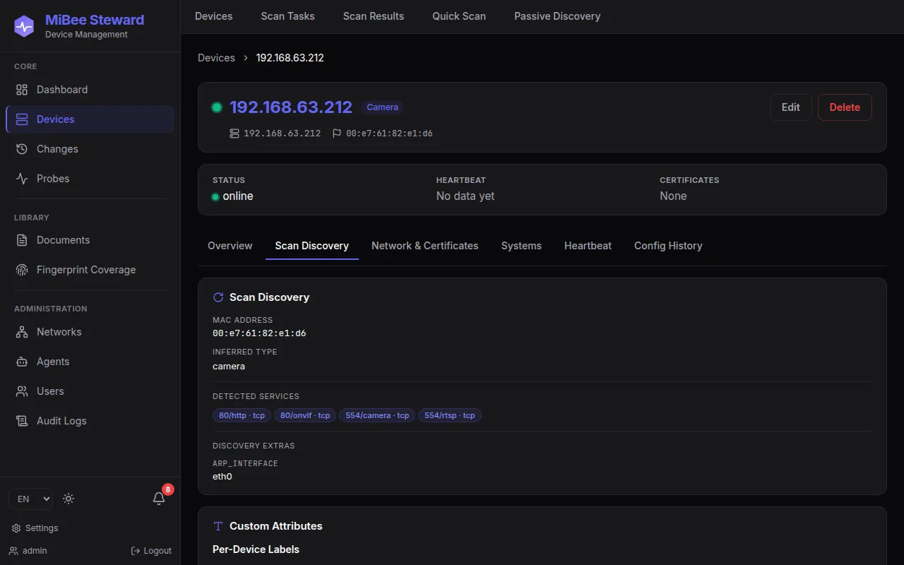

3. Switch to the **Network & Certificates** tab for TLS certificates: chain, issuer, validity, days-remaining badges with color tiers (15/30/60/90 days). Self-signed certs on NAS boxes and routers are inventoried the same way.

   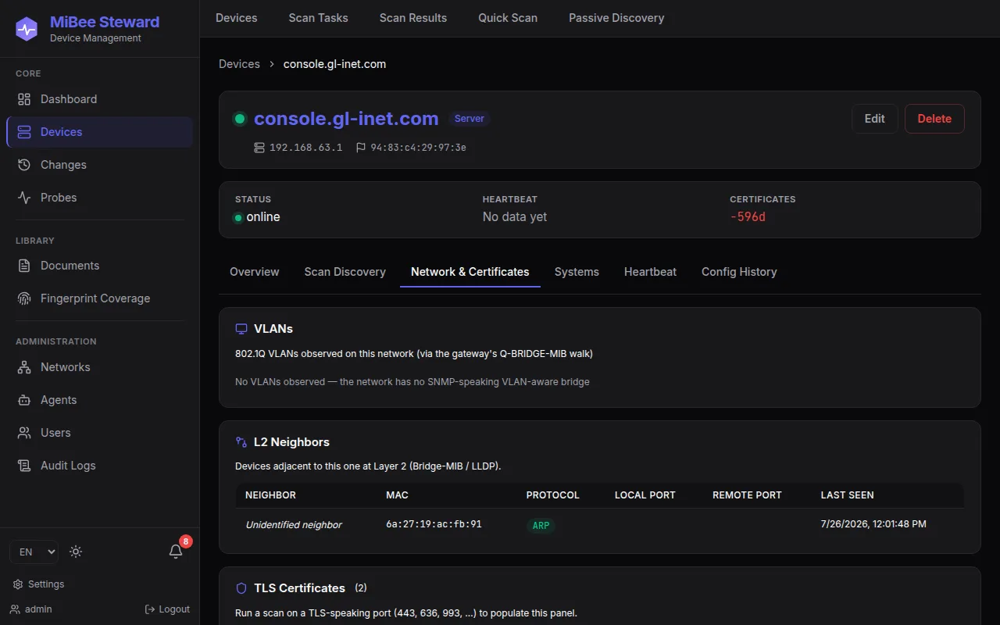

4. Wondering "why was this classified as a camera?" — open the **Fingerprint coverage** page: every identification verdict traces back to a YAML rule (3,869+ and growing).

   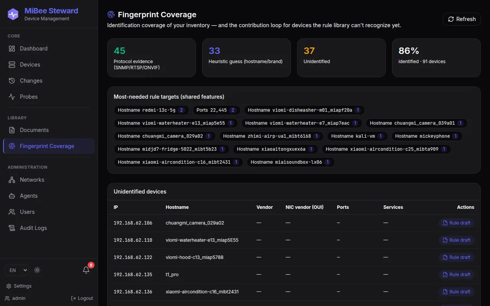

**Where to go next**: add manual attributes (location, purpose, tags) on the overview page; upload manuals/receipts as attachments and turn the inventory into a real asset dossier.

## Scenario 4: Switch topology — who's plugged into which port

**Goal**: use LLDP/CDP/Bridge-MIB evidence to draw the L2 adjacency graph and answer "which switch port is this device on, in which VLAN". Prerequisite: switches with SNMP enabled (read-only is enough).

1. Scan the switches' subnet first (scenario 1) with SNMP community/v3 credentials configured — all topology evidence comes from SNMP walks.
2. Open the **Topology** page: a layered force-directed layout separates core/distribution/access tiers; the legend doubles as a per-tier filter.

   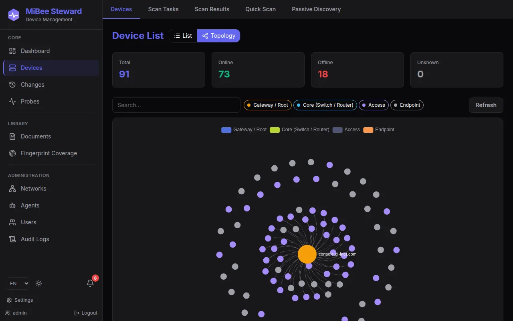

3. Type an IP or hostname in the search box to locate a device: matches and their neighbors stay lit while everything else dims — see at a glance "who it connects to".

   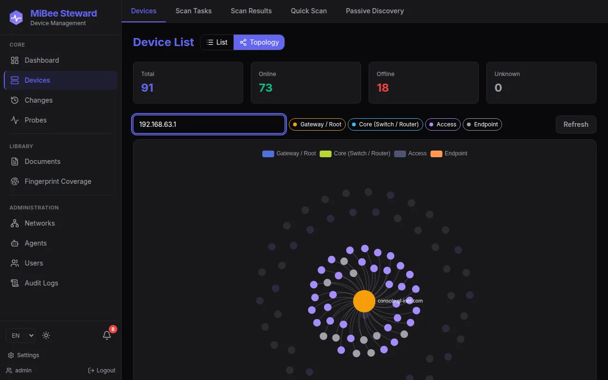

4. Click a node for its detail card (IP/MAC/type/degree); click an edge to drill into local/remote port names, VLAN tags, and STP roles (human-readable names like `Gi1/0/24` come from IF-MIB ifName resolution).

**Where to go next**: enroll the switches in [config backup](features.md) so every configuration change is versioned and reversible.

## Scenario 5: External probing and certificate-expiry watch

**Goal**: watch assets *outside* your network — public sites, hosted TLS services: availability, latency, and days-to-cert-expiry.

1. Open the **Probes** page and click **+ New Target**:
   - HTTP module for websites (e.g. `https://example.com`);
   - TLS module when you only care about certificates (e.g. `example.com:443`);
   - `host:port` for TCP reachability, plain ICMP for connectivity.
   Keep the default interval (anything from 10s to 24h is available).
2. Results arrive within seconds. The page top summarizes success rate and average latency per module; the target list below carries status, latency, and **cert-days-remaining badges**.

   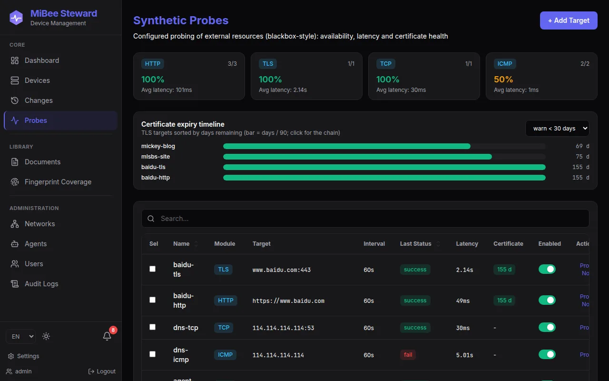

3. Click any bar in the "certificate expiry timeline" to open the **full certificate chain** modal — leaf and intermediate CA subjects, issuers, serials, SANs, validity, with one-click PEM copy.

   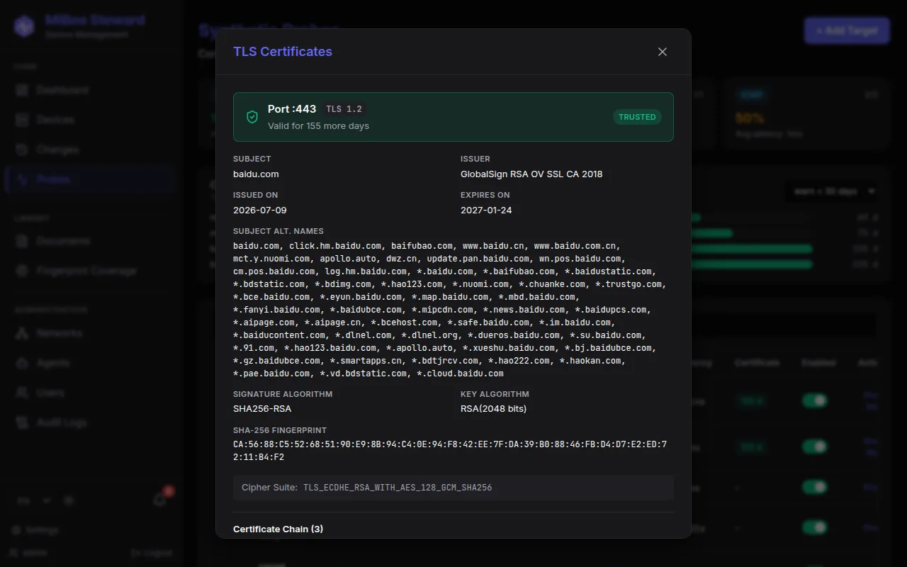

4. (Optional) Prometheus integration: `mibee_probe_up`, `mibee_probe_cert_expiry_timestamp_seconds` and friends are exposed out of the box; example alert rules (target down / cert expiring within 30 days) live in [deploy/prometheus/alert_rules.yml](https://github.com/Mi-Bee-Studio/MiBeeSteward/blob/main/deploy/prometheus/alert_rules.yml).

**Where to go next**: add your company site, API gateway, and mail-server TLS ports — inside assets are covered by scanning, outside assets by probing; together they form the complete asset view.

## Scenario 6: One inventory across multiple subnets (advanced)

**Goal**: a network at home, one at the office, one in the rack — drop a lightweight agent in each subnet and let the center aggregate a global asset portrait.

1. On the center, create the network and an agent token (**Agents** page; the token is displayed exactly once).
2. On an always-on host in the target subnet, deploy `mibee-agent` (also a single binary, runs as a regular user) configured with the center address and token.
3. The agent reports outbound to the center (works behind NAT; no inbound exposure); stable networks take the state-hash fast path at near-zero cost.
4. Trigger scans from the center over the command channel, or let the agent scan on schedule.

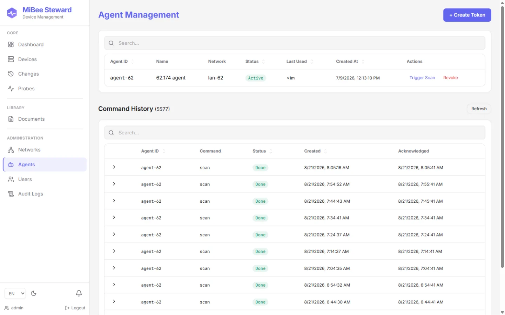

Detailed steps in the [distributed deployment guide](distributed.md).

---

## Suggested progression

1. [Schedule async scan tasks](web-ui.md) — automate inventory freshness.
2. [Integrate Prometheus/Grafana](integrations.md) — feed asset data into your observability stack.
3. [Config backup](features.md) — versioned insurance for network-device configuration.
4. [RBAC and network scoping](features.md) — permission hygiene for team setups.
