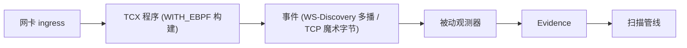

# eBPF 被动观测

## 概述

MiBee Steward 的扫描引擎（scannerv2）采用**双探测架构**：主动探测（TCP/SNMP/ONVIF 等）负责精确识别，被动观测负责在不向网络发送任何探测包的前提下，从真实流量中收集补充证据。eBPF 被动观测正是后者的实现--它挂载在 Linux 内核的 TCX 入口钩子上，以零干扰方式窥探经过网络接口的入站数据包，匹配已知协议签名后将证据交给分类层融合。

> **定位**：eBPF 观测是**辅助信号**，不是主动探测的替代。ONVIF/WS-Discovery 的组播通告是最佳被动目标，而 TCP 协议（SSH/RTSP/HTTP）仍以主动探测为主，eBPF 的匹配结果作为**佐证**以置信度 0.6 注入。

## 工作原理

`tc_ingress.c` 挂载到网络接口的 TCX ingress 钩子，检查入站数据包的协议签名。完整的数据包路径如下：



| 签名 | 证据类型 | 分类结果 |
|------|---------|---------|
| TCP 载荷 `SSH-...` | `banner` | ssh |
| TCP 载荷 `RTSP/1...` | `rtsp_banner` | rtsp |
| TCP 载荷 `HTTP/1...` | `banner` | http |
| UDP/3702 ↔ 239.255.255.250 | `wsdiscovery` | onvif |
| UDP/67-68 DHCP | `dhcp`（vendor class / 参数请求表 / 消息类型，#496/#508） | dhcp |
| TCP ClientHello | `tls_sni`（SNI 主机名） | https |
| UDP/5353 mDNS 查询 | `mdns`（首个查询名） | mdns |
| UDP/1900 SSDP | `ssdp`（存在性） | ssdp |
| ARP（任意 op） | `arp_sighting` → discovery 通道（#497） | —（在网事实，非证据） |
| IPv6 NS/NA/RS | `nd_sighting` → discovery 通道（#497） | —（在网事实，非证据） |

匹配结果通过环形缓冲区（`events` map）发送到 Go 用户态，由加载器转换为 `scannerv2.Evidence`，标记 `Source: "passive:ebpf:tc"`。存在性/banner 类匹配置信度 `0.6`；携带身份信息的签名更高：DHCP `0.8`（vendor class + 参数请求表直接驱动 DHCP 指纹规则），TLS SNI `0.7`。分类层将此被动证据与主动探测证据融合，得出最终识别结论。

**关键特性**：程序**从不修改或丢弃数据包**--它是纯粹的观测（`TC_ACT_UNSPEC`）。在网桥上请挂载**物理口**（`eth0`、`eth1`……）而非网桥设备本身：桥端口之间转发的帧不经过桥设备的 TC 钩子。

## ARP / ND 被动在网（#497）

除服务签名外，观测器还捕捉**线缆级在网事实**：ARP 发送方的 IP+MAC 对，以及 IPv6 NS/NA/RS 说话者。它们是网络事实而非服务证据——走 **discovery 通道**（`source=passive:ebpf:arp`），与其他 discovery 源共用同一套去重/已知主机/识别漏斗。这是沉睡设备的第三条捕捉路径（前两条：主动扫描、DHCP 租约）：既不应答也无租约续约的主机，仍然会讲 ARP。

值得了解的机制：

- **节流在 BPF 程序内完成**：LRU map 按（发送方 IP, MAC, kind）每 ~30 秒桶只放行一次。gratuitous-ARP 风暴（rig 上 1000 帧实测）只产生一个事件，其余根本进不了环形缓冲。map 为 LRU、上限 8192 条，内存有界；被逐出后的再次目击会重新发一次事件——方向正确（在网状态被刷新而非丢失）。
- **DAD 探测（发送方 0.0.0.0）在 BPF 层过滤**——它不携带身份。
- **ND 目击按 MAC 键控**：发送方的 IPv6 已解码保留，但 discovery 目前以 IPv4 为主键，等待 MAC 键控通道落地（#522）。
- **网桥形态价值最大**：挂物理口——桥转发的帧不过桥设备自身的 TC 钩子（见 `scanner.ebpf.interfaces` 的说明）。

## 构建方式

eBPF 支持通过构建标签（build tag）控制，默认构建**不含任何内核依赖**：

```bash
# 默认构建，不含 eBPF（使用空操作桩）：
make build

# 含 eBPF 支持的构建（只需 clang >= 14，任意宿主操作系统）：
make build-with-ebpf
```

- **默认构建**：使用 `internal/service/scannerv2/ebpf/observer_stub.go` 空操作桩，零内核/工具链依赖
- **eBPF 构建**：分两步。先生成 bpf2go 绑定--它调用 `cilium/ebpf` 的 bpf2go 把 `tc_ingress.c` 编译为 BPF 对象并生成 Go 绑定。该程序是**无 CO-RE** 的（只使用稳定 UAPI 类型，见 `bpf/bpf_standalone.h`），因此构建期**不需要 bpftool、内核 BTF 和 libbpf 头文件**。生成产物（`tcingress_*.go/.o`，注意小写文件名）是 gitignore 的构建产物。然后 `make build-with-ebpf` 以 `-tags WITH_EBPF` 构建，BPF 对象嵌入最终二进制

```bash
# 步骤 1：生成 bpf2go 绑定（只需 clang；产物不入库）。
# 生成指令位于带 WITH_EBPF 标签的文件中，因此必须带标签：
go generate -tags WITH_EBPF ./internal/service/scannerv2/ebpf/

# 步骤 2：构建
make build-with-ebpf
```

由于产物**不含 CO-RE 重定位**，它在**没有 BTF 的内核上同样可以加载**——构建可移植，产物也可移植。

## 运行时要求

仅 `WITH_EBPF` 构建需要以下条件：

| 要求 | 说明 |
|------|------|
| **内核** | Linux ≥ 6.6（加载器经 TCX 挂载；BTF **可选**——程序无 CO-RE） |
| **权限** | root，或 ambient `CAP_BPF` + `CAP_NET_ADMIN`（见 `deploy/mibee-steward-ebpf-dropin.example.conf`） |
| **配置** | `scanner.ebpf.enabled: true`；`scanner.ebpf.interfaces` 留空 = 全部非 loopback 且 up 的接口 |

已在 arm64 rig（内核 6.18.44，Armbian）上以 root 实测：观测器附接并进入 `active`，真实 LAN 流量（SSH/HTTP banner、SSDP 心跳、mDNS）以及注入的 DHCP/mDNS/SSDP 帧均以 `passive:ebpf:tc` 证据行落库，字段提取干净（DHCP vendor class、参数请求表、消息类型；mDNS 查询名）——DHCP 指纹规则随后仅凭被动证据即可驱动设备品牌推断。另在内核 6.18（WSL2 x86-64）与 6.6 档（OpenWrt 24.10 目标）验证。

**ambient caps 注意事项（因内核而异）**：文档所述 systemd drop-in 形态（非 root 用户 + ambient `CAP_BPF`/`CAP_NET_ADMIN`）在很多内核上可以载入，但在部分内核上——同一台 6.18.44 sunxi 盒子实测——加载器会以 `EFAULT` 拒载，而同一二进制在同一主机以 root 则正常载入运行。这是内核加载器/verifier 在 ambient caps 下对有界循环的怪癖，不是程序缺陷；触发时观测器报告 `failed` 并给出原因，服务本体与主动扫描不受影响（#493 降级规则）。若你的 drop-in 形态遇到此情况，请将该观测点的 center 进程改以 root 运行。程序仍然刻意不含变长包指针运算（全部经 helper 读取）：含此类运算的版本在这些内核上于 ambient caps + 非 root euid 下会被 verifier 拒载（root 则都能载入）。

## 降级与可观测性

降级红线：**eBPF 的任何问题只会让观测器静默，绝不会让服务器崩溃、也绝不会阻塞主动扫描**（#493）。观测器在触碰内核之前先做前置条件评估，并通过状态机报告生命周期：

| 状态 | 含义 | 示例 |
|------|------|------|
| `active` | 完全可用 | 全部接口附接成功 |
| `degraded` | 以降级能力运行 | 附接 1/2 个接口；ringbuf 读错误熔断触发 |
| `unsupported` | 前置条件不满足，未尝试加载 | 内核 < 6.6；缺 `CAP_BPF`/`CAP_NET_ADMIN`（指名缺哪个） |
| `failed` | 启动尝试失败 | 程序加载/验证错误（完整原因见日志） |
| `pending` | 已启用，惰性启动尚未运行 | 观测器在第一次扫描的首个探针时启动 |
| `disabled` / `not-built` | 配置关闭 / 二进制未带 WITH_EBPF 标签 | — |

每次状态迁移只打一条日志（`active` 为 info，降级为 warn 并附可操作的原因）。ringbuf 读取带错误熔断：连续 100 次读错误后停止并降级，绝不忙转。

`mibee-steward doctor` 会**主动**评估前置条件——无需先跑一次扫描——在启动任何东西之前就能回答"这台机器能不能跑 eBPF"：

```text
✅ ebpf observer    kernel=6.6.144 btf=true caps=ok
❌ ebpf observer    missing privileges: CAP_NET_ADMIN, CAP_BPF (run as root, or grant ambient caps — see docs/en/ebpf.md)
   ❌ hint: grant ambient caps via a systemd drop-in — see deploy/mibee-steward-ebpf-dropin.example.conf
```

## 配置

在 YAML 配置文件中启用：

```yaml
scanner:
  ebpf:
    enabled: true
    interfaces:
      - eth0
      - eth1
```

- `scanner.ebpf.enabled`：是否启用 eBPF 被动观测（默认 `false`）
- `scanner.ebpf.interfaces`：要附接的接口；**留空 = 全部非 loopback 且 up 的接口**。网关形态建议显式列出以控制观察面；网桥形态请列物理口

更多扫描配置请参阅 [配置](configuration.md)，网络发现相关配置请参阅 [网络发现](discovery.md)。

## 适用场景

### 何时使用 eBPF 被动观测

- 运行在网关/路由器上，能接触到所有入站流量
- 需要发现不响应主动探测的设备（如休眠 IoT、防火墙严格的主机）
- ONVIF 摄像头的组播通告检测（最佳被动目标）
- 希望在不增加网络流量的情况下获取补充证据

### 何时主动探测已足够

- 网络设备均响应 SNMP/ICMP 探测
- 运行环境不满足 eBPF 要求（内核 < 6.6、无权限）
- 容器/虚拟化环境无法获取 `CAP_BPF` 权限

## 已知限制

- **仅 Linux**，内核 ≥ 6.6（TCX 挂载）；BTF 可选（程序无 CO-RE）
- **需要特权**：root 或 ambient `CAP_BPF` + `CAP_NET_ADMIN`；现代内核默认关闭非特权 BPF
- **TCP 信号为佐证**：SSH/RTSP/HTTP 的匹配仅作为置信度 0.6 的辅助证据，不替代主动探测
- **无 CGO 依赖**：默认构建完全不含 eBPF 代码，适合所有部署环境
- **网桥上挂物理口**：桥转发的帧不经过桥设备自身的 TC 钩子

## 迭代 C 程序

```bash
cd bpf && make tc_ingress.o
```

只需 `clang`（≥ 14），任意宿主操作系统。程序按构造就是无 CO-RE 的（`bpf/bpf_standalone.h` 提供 UAPI 类型与 cilium/ebpf 静态指针风格的 helper 声明）；**不要**引入对内核内部类型的访问——那会悄悄重新引入 BTF/CO-RE 依赖。边界检查必须完整：每一处包字段读取都必须被一条覆盖整个结构体的前置边界检查保护（TCP 头检查保护的是偏移 12 处的 `doff` 位域容器——8 字节的窗口不够）。

## 相关页面

- [网络发现](discovery.md)，完整的发现源列表和配置
- [配置](configuration.md)，所有配置项参考
- [架构](architecture.md)，扫描引擎整体架构
