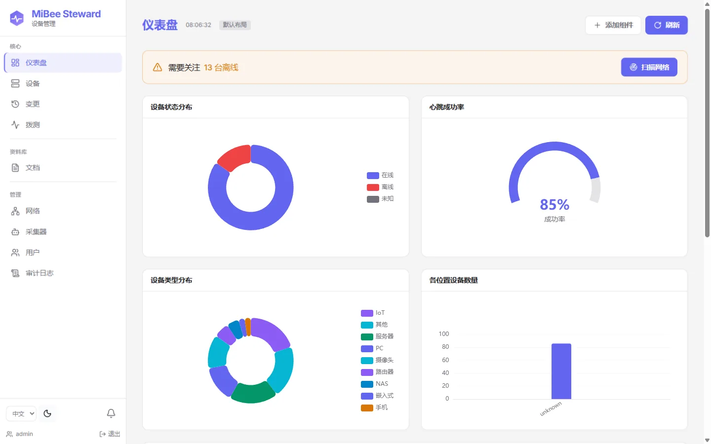
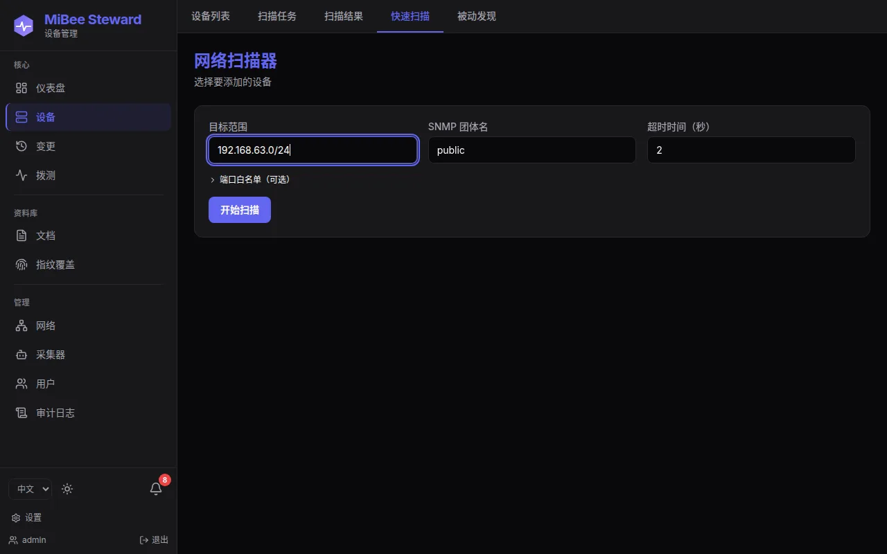
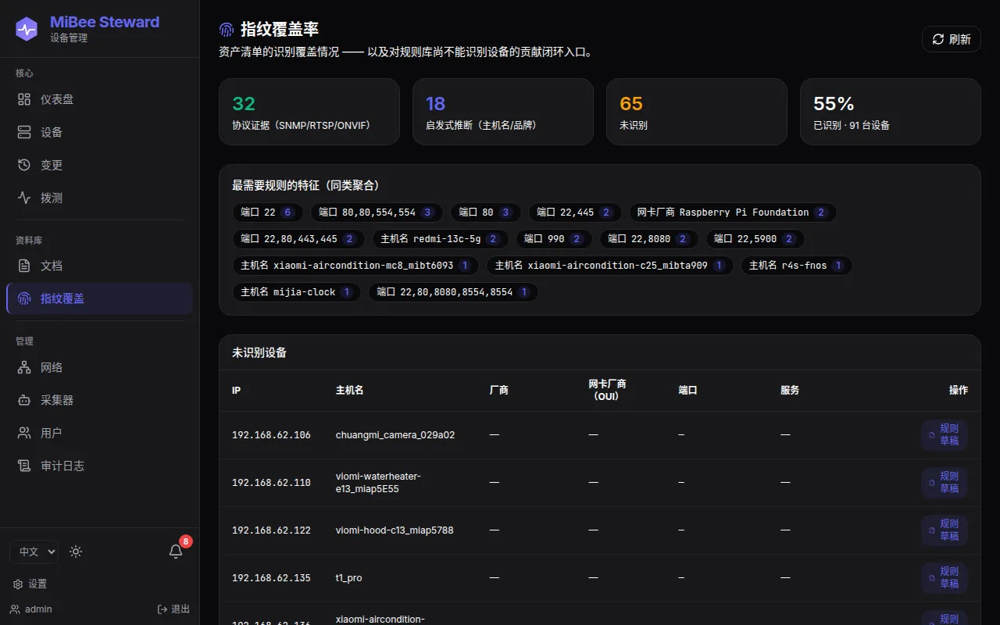
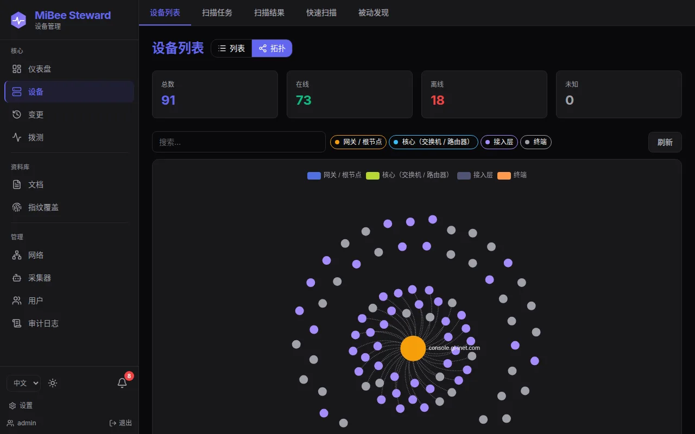
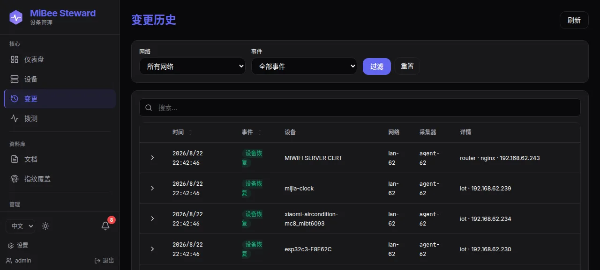
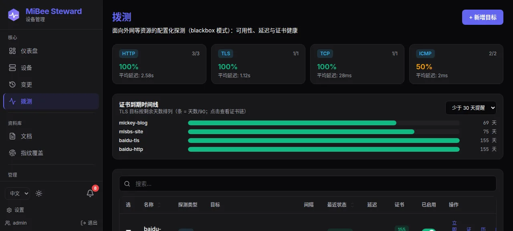
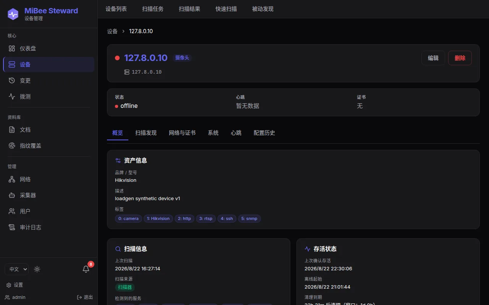

# MiBee Steward 功能总览

本页是 MiBee Steward 的完整能力清单，以 **v0.5.0**（2026-08-19 发布）为基线。MiBee Steward 是一个**设备/网络层的资产发现、识别与登记**工具——回答三个问题：*网络上有哪些设备？它们是什么？它们还活着吗？* 每个功能都围绕这三问展开；明确的[产品边界](product-scope.md)之外的活儿，主动让位给更成熟的工具。

## 能力地图

| 层 | 模块 | 一句话 |
|---|---|---|
| 发现 | 多协议扫描 / 被动发现 / 路由器侧数据源 / eBPF | 把网络里的东西找出来 |
| 识别 | 指纹规则库 / OUI 厂商 / 设备类型推断 | 认出它是谁（品牌、型号、类型） |
| 登记 | 资产台账 / 心跳鲜活度 / 设备系统 | 登记成持续保鲜的账本 |
| 理解 | L2 拓扑 / 变更检测 / TLS 证书盘点 | 理解设备之间的关系与变化 |
| 运维 | 配置备份 / 拨测 / 通知 / 分布式采集 | 日常资产运维 |
| 平台 | REST API / Prometheus 出口 / Web UI / RBAC | 对接与治理 |

## 发现（Discovery）

**扫描引擎 v2**：插件化五层流水线（探测 → 分类 → 处理 → 持久化 → 编排），新增协议只需一个 Classifier + 一个 Handler，不触碰编排与持久化层。

- **主动探测**：ICMP、TCP 端口扫描、SNMP（v1/v2c/v3 USM）、HTTP、RTSP、ONVIF、ARP、mDNS/SSDP/NetBIOS（UDP）、rDNS（可配置专用 DNS 服务器）、SMB2 协商、FTP banner；指数退避重试（1s → 2s → 4s，仅网络错误）。
- **级联深采**：扫到 HTTP → 探测 `/metrics` → 识别为 Prometheus → 级联探测 node_exporter → 自动回填硬件信息，一次扫描把设备画像越滚越细。
- **被动发现服务**（opt-in）：两次计划扫描之间用 ARP 差分 + mDNS/SSDP 被动监听近实时登记新设备，把发现到登记的间隔缩短到约 1 分钟。
- **路由器侧数据源**（跑在路由器上时）：DHCP 租约（dnsmasq）、conntrack 连接表、hostapd WiFi 工作站（信号强度/关联时间）、dnsmasq DNS 查询日志（被动 DNS 指纹）。
- **路由器 ARP 表**：SNMP 遍历路由器 ARP 表，解析跨网段设备的 MAC。
- **eBPF 被动观测器**（可选构建）：TC ingress 程序嗅探 WS-Discovery 多播与 TCP 魔术字节，作为补充证据源。
- **LLDP 原始帧监听**（可选构建）：AF_PACKET 捕获 0x88cc，为不开放 SNMP 的端点提供 LLDP 证据。
- **发现漏斗状态**：接收 → 抑制 → 已知跳过 → 识别 → 存活确认 → 登记，全链路计数器与最近发现列表。

## 识别（Identification）

- **数据驱动的指纹规则库**：识别规则是 YAML 数据而非硬编码，启动时从本地路径或二进制内嵌资源加载；新增一个厂商/型号签名 = 加一条 YAML，社区可贡献。
- **导入语料**：Rapid7 Recog（Apache-2.0，约 1100+ 规则）+ SNMP 表（合计约 2500+ 规则），经 `cmd/fpimport` 转换；nmap 语料因协议不兼容仅作 clean-room 参考、不导入。
- **协议指纹分类**：banner、HTTP（Server 头/HTML body）、RTSP、ONVIF 设备信息、SNMP sysObjectID/sysDesc、Prometheus/node_exporter、TLS 证书、SSH/Telnet banner。
- **摄像头跨证据融合**：RTSP + ONVIF + HTTP 三级分类器专为 IP 摄像头场景优化（SNMP 位掩码启发式保留为 Go 代码）。
- **OUI 厂商推断**：IEEE MA-S(/36)/MA-M(/28)/MA-L(/24) 三注册表最长前缀匹配，区分「网卡芯片厂商」与设备自报品牌；内置精选 CC-BY-SA 表开箱即用，可配置完整 IEEE 数据覆盖。
- **设备类型推断表**：hostname/brand/port → 设备类型的关键字表同样是数据（YAML），来源标记 `heuristic`（主机名猜测，UI 显示 `?` 徽章）与 `protocol`（协议证据）区分可信度。
- **MAC 观测标志**：本地管理位（U/L）、多播位作为中性观测字段记录，不影响资产身份。

## 资产登记与心跳（Registry & Liveness）

- **多网络资产台账**：`networks` + 复合唯一 `(ip, network_id)`，同一私网 IP 可存在于不同网络；MAC 为首要 upsert 键，漫游设备保持单一资产；`device_uuid` 贯穿卫星表，改 IP 不分叉历史。
- **心跳探测**：每设备可配 ICMP/TCP/HTTP/SNMP 探针与间隔（默认 30s），5 次失败判离线；离线设备退避探测（默认每 10 tick 一次），扫描复活即清零失败计数。
- **存活时间序列**：`device_liveness` 每 tick 一条在线/离线判定，在线率、离线时长、历史曲线可查；状态翻转不再刷屏变更日志。
- **静默资产保留**：无心跳的扫描发现设备按 MAC 有无分别 7 天/24 小时自动清理；手工录入的设备永不自动删除。
- **设备系统档案**：一台设备可挂多个已安装系统（含入口 URL），卡片式 UI 带分类徽章。
- **设备附件**：说明书/照片/发票上传到 `data/uploads`，挂在设备名下。

## 拓扑（Topology）

- **交换机侧 L2 邻接**：LLDP-MIB（跨厂商标准）、CISCO-CDP-MIB（`cdpCacheTable`）、Bridge-MIB 转发表、Q-BRIDGE-MIB（`dot1qTpFdbPort`，VLAN 感知的 MAC→端口）、STP-MIB（根桥/指定端口/端口角色）、IF-MIB（ifIndex → 人读端口名）。
- **物化拓扑边**：`device_neighbors` → `topology_edges`（设备↔设备边，含本地/远端端口、VLAN 标签、STP 角色）；子网与 VLAN 表（802.1Q）随扫描更新。
- **可视化**：分层力导向布局（核心/汇聚/接入三层着色，图例即层过滤器）、搜索聚焦（非匹配节点变暗）、邻居高亮 + 节点详情卡、端口钻取，大图增量重建保持交互。

## 变更检测（Change Detection）

- **三类事件**：`device_added` / `device_changed` / `device_lost`（以及 `device_config_changed`），自动写入 `change_log` 并推送进程内 Watcher。
- **防抖**：连续扫描 miss 计数阈值（默认 2）防单次漏扫误报；agent 网络用租约 TTL 判丢失，抖动计数衰减趋向丢失而非反复横跳。
- **设备更换检测**：同 IP 换设备时 IP 持有者胜出，身份强制覆盖，旧记录标离线，新旧关系入变更日志。
- **消费接口**：`GET /api/v1/changes` 查询历史；`GET /changes/watch` SSE 实时流；UI 时间线带结构化前后对比。

## 设备配置备份（Config Backup，v0.5.0，opt-in）

Oxidized/RANCID 风格的网络设备配置拉取与版本管理：

- **计划任务**：按计划对路由器/交换机/防火墙执行 SSH `running-config` 拉取，版本化存储（`device_configs`），仅变更时生成新版本。
- **厂商命令矩阵**：JunOS `show configuration | display set`、HP/Aruba/H3C/Comware `display current-configuration`、Cisco IOS/NX-OS、Arista、Huawei VRP、MikroTik 及未知厂商回退 `show running-config`。
- **SSH 主机密钥 TOFU**：首次使用即信任并记录。
- **差异对比**：任意两版本 unified diff；设备详情「配置历史」标签页带手工着色的 diff 渲染；配置变更联动变更检测与通知。
- **加密凭据库**：SSH 凭据 AES-256-GCM 加密存储，写入加密、读取脱敏。

## 拨测（Synthetic Probing，v0.5.0）

blackbox 风格的外部资源周期探测——公网站点、托管 TLS 端口等「网络外」的资产：

- **四种模块**：`http`（状态 <400 为成功，https 附带证书链）、`tls`（完整证书链）、`tcp`、`icmp`；每目标可配间隔（10s–86400s）与超时（1–60s）。
- **引擎**：10s tick 重读目标（增删改即时生效，无需重启）、8 并发、断点续跑、手动触发。
- **证书库存**：复用扫描器的证书链采集，SNI 自动推导；瞬时失败保留最后已知良好链。
- **指标与告警**：`mibee_probe_up` / `mibee_probe_duration_seconds` / `mibee_probe_cert_expiry_timestamp_seconds`，附带示例告警规则（目标宕机、证书临期）。

## 通知（Notifications）

- **渠道**：webhook（飞书/企业微信/Telegram/Discord 均可走 webhook）与邮件（SMTP），支持测试发送。
- **内置通知规则**（v0.5.0）：事件类型（设备丢失/恢复/新增/变更/配置变更）× 范围（全部/某网络/某设备）→ 目标渠道；每（规则×设备）冷却窗口（默认 30 分钟）防刷屏——刻意是「规则 → 渠道」的薄转发，不是告警引擎。
- **按用户未读跟踪**：顶栏铃铛未读计数，打开即清。

## 分布式采集（Agents）

- **跨网段模型**：center + agent（`mibee-agent` 独立二进制，CGO-free，普通用户即可运行）；agent 扫描本地 LAN，通过 HTTPS 上报 center。
- **NAT 友好的拉模型**：agent 主动发起全部连接（上报 + 命令轮询约 60s 周期），center 无需暴露入站端口。
- **抗熵快路径**：`X-Network-State-Hash`（存活集合身份字段的 SHA-256）命中时 center 跳过逐设备处理，只刷租约——稳态网络近零开销。
- **租约模型**：agent 上报刷新每设备租约，TTL（默认 5 分钟）过期由后台清扫器判丢失。
- **命令通道**：center 下发扫描等命令，agent 轮询 → 确认 → 完成；可选远程运维（重启/重载配置/日志尾随，双向开关 + 审计）。
- **机器令牌**：agent bearer token 绑定 `agent_id` + `network_id`，管理员 CRUD，一次性展示。

## 安全与访问控制（Security & RBAC）

- **认证**：JWT（cookie 优先 + Bearer 回退）、登录锁定、令牌黑名单；TOTP 两步验证可选。
- **多角色能力模型**（v0.5.0）：`admin` / `operator` / `viewer` 映射到细粒度能力集（`CapDeviceRead`、`CapScanTrigger`…），每条路由按能力 gating，未知角色一无所授。
- **对象级网络授权**：按用户分配可见网络；`closed` 模式下非管理员只见被授权网络（设备、扫描、变更、拓扑、导出全读面），未授权详情返回 404，管理员始终绕过。
- **SNMPv3 凭据库**：USM 凭据（认证/加密口令与协议、安全级别）AES-256-GCM 加密存储，读取永不回显；v3 下全部 OID 路径可用（身份 8 OID + 全部拓扑 walk）。
- **基础设施**：CSRF、速率限制（登录 10/分、全局 600/分、扫描 10/分）、安全响应头、可信代理白名单的 RealIP、全量敏感操作审计日志、`reset-admin-password` CLI 子命令。

## API 与集成（API & Integrations）

- **REST API**（`/api/v1`，snake_case）：设备、扫描任务/运行/结果、变更、网络、采集器与令牌、用户与授权、审计、文档、通知渠道与规则、凭据、拨测目标、拓扑、发现状态。
- **Prometheus 出口**：`/metrics`（资产状态 gauge、心跳计数/延迟直方图、扫描运行/时长/任务、拨测指标、网络漂移 gauge）；`/sd` HTTP 服务发现端点，把发现的资产自动注册进 Prometheus。
- **导入导出**：CSV 导入（含逐行错误反馈）、CSV/JSON 导出（CSRF 安全）。
- **生态**：Grafana 仪表盘示例、7 条示例告警规则（宕机、5xx、心跳失败、DB 锁、内存、拨测目标宕机、证书临期）、n8n 与 Home Assistant 对接指南。

## Web 界面（Web UI）

SvelteKit 5 单页应用嵌入二进制，中英双语（自动检测 + 区域格式化）、明暗主题、响应式布局、键盘可达性。

| 页面 | 能力 |
|---|---|
| 仪表盘 | 可配置组件卡（状态分布、心跳成功率、类型分布、位置分布）、扫描活动、需要关注横幅 + 一键扫描 |
| 设备列表 | 跨网络聚合、筛选（状态/类型/网络）、可选列（本地持久化）、服务端搜索/排序/分页（含数值 IP 排序）、拓扑视图切换 |
| 设备详情 | 健康横幅 + 标签页：概览 / 扫描发现（服务/端口/banner）/ 网络与证书（TLS 链、邻居、子网）/ 系统 / 心跳 / 配置历史 |
| 扫描中心 | 快速扫描（同步）、扫描任务（异步，支持取消）、扫描结果、被动发现漏斗 |
| 拓扑 | 分层布局、层过滤、搜索聚焦、邻居高亮、端口钻取 |
| 变更 | 时间线 + 事件筛选 + 结构化差异 |
| 拨测 | 目标管理、状态/延迟/证书天数徽章、历史与证书链模态框 |
| 采集器/网络/用户/审计 | 分布式运维与治理面 |
| 设置 | 个人资料/密码/TOTP/主题语言；通知渠道与规则；SNMP 凭据 |

## 部署与运维（Deployment & Operations）

- **单二进制零依赖**：CGO-free（modernc.org/sqlite 纯 Go），前端 `go:embed` 嵌入，SQLite WAL 内嵌存储；`make build-all` 交叉编译 linux amd64 + arm64。
- **部署形态**：systemd + Nginx、Docker（多阶段非 root、多架构 GHCR 镜像、bridge/host/macvlan 网络档位）、OpenWrt procd（center + agent，UCI 配置，ARMv7）。
- **保留策略**：分表批量清扫（心跳 7 天、扫描 30 天、审计 90 天等，全部可配），静默设备自动清理。
- **数据安全**：启动自动迁移（变更前 `VACUUM INTO` 备份）、schema 版本门控、`scripts/backup.sh`（`.backup` + 完整性检查，7 天保留）。
- **配置**：koanf（YAML + `MIBEE_*` 环境变量覆盖），示例配置覆盖全部模块。
- **可观测性**：slog 结构化日志、请求/扫描/心跳/拨测指标、绑定重试抗重启风暴、优雅停机。

## 产品边界（不做什么）

与[产品范围](product-scope.md)一致，以下能力**有意不做**，交给更合适的工具，通过 `/metrics` 与 `/sd` 出口对接：

| 不做 | 推荐替代 |
|---|---|
| 告警引擎（阈值/静默/路由树） | Prometheus + Alertmanager |
| 自由探索式仪表盘 | Grafana |
| 状态页 | Uptime Kuma / gatus |
| 主机深度监控（CPU/内存/磁盘） | node_exporter / Netdata |
| L7 服务注册发现 | Consul / etcd |
| 配置下发/推送 | Ansible / Oxidized |

内置通知规则只做「设备事件 → 渠道」的薄转发——需要真正的告警语义时请上 Alertmanager。
