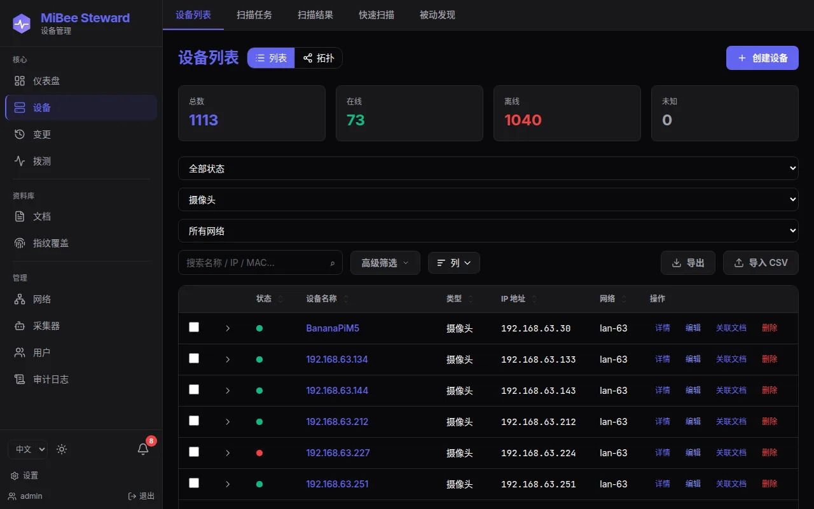
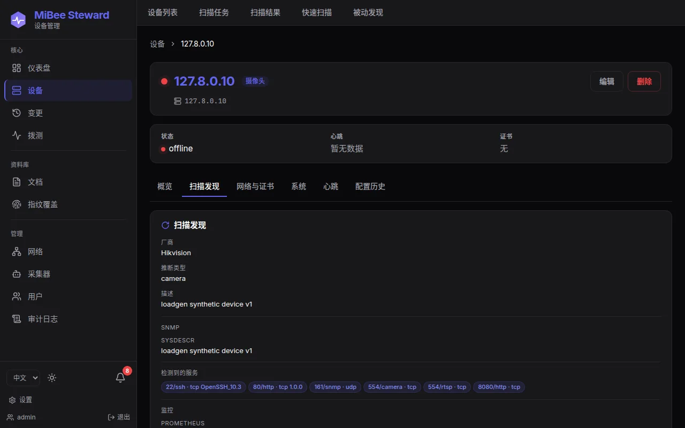
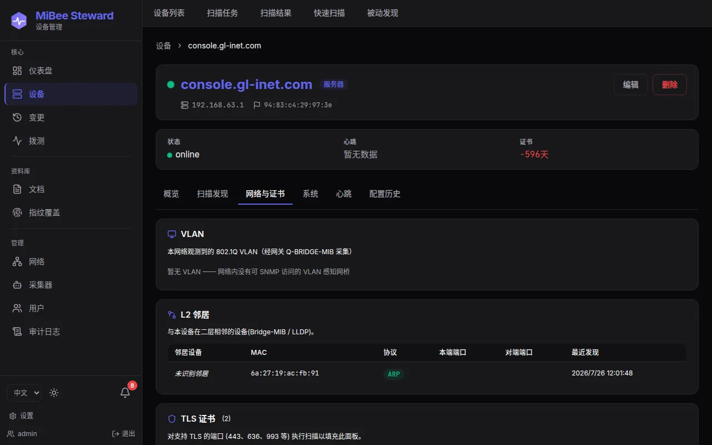
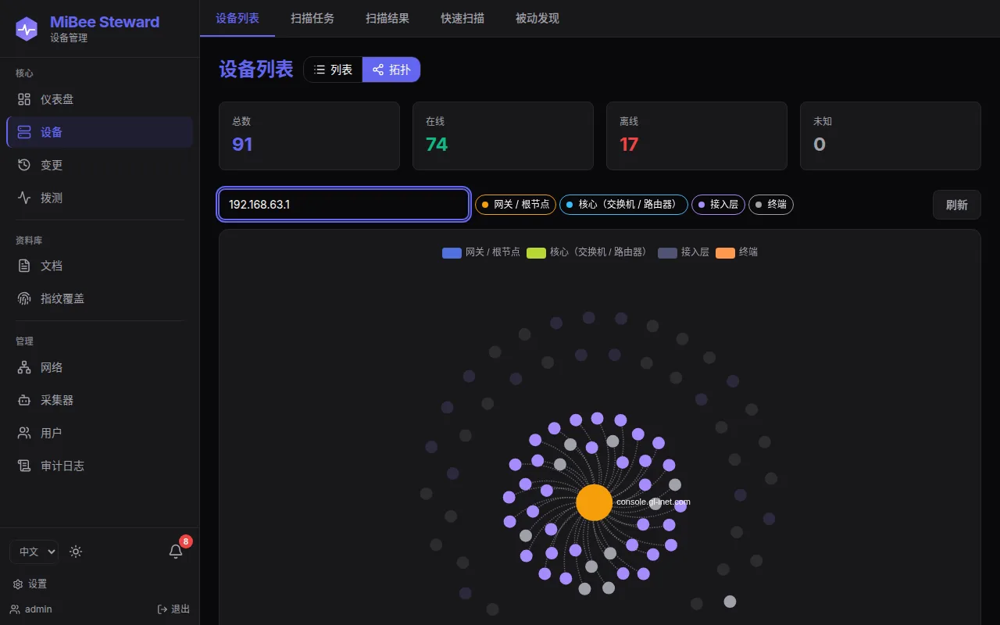
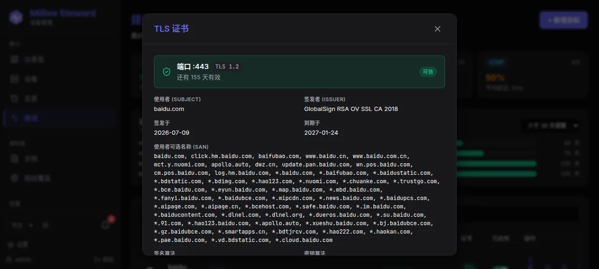

# 场景玩法指引

面向新手的上手路径：几个真实场景，每个 5–15 分钟走完，边做边理解产品。前置条件只有一个——你已经按[快速开始](quick-start.md)部署并登录了 MiBee Steward。

> 提示：截图取自真实界面。如果你的数据与图中不同，那很正常——发现结果取决于你的网络里实际有什么。

## 场景一：15 分钟，第一次看清你的网络

**目标**：扫一遍家庭或办公室网络，得到一份带品牌/型号/类型的设备清单。这是所有后续玩法的基础。

1. 登录后进入 **设备 → 快速扫描**。
2. 目标栏填入你的网段，例如 `192.168.1.0/24`（单台设备也可以直接填 IP）。
3. 如果网络里的设备开了 SNMP，community 默认 `public` 不对就改成你的；没配 SNMP 可以留空跳过。超时保持默认 2 秒即可。

   

4. 点击 **开始扫描**。一个 /24 通常几十秒到几分钟，页面会实时显示进度。
5. 扫描完成后进入 **设备列表**——你会看到每台设备的 IP、类型、品牌、在线状态。识别不出的设备也会以原始 IP 形式登记，后续扫描会逐步补全画像。

   

6. 点开任意一台设备看 **概览**：识别出的类型、品牌、型号、MAC、序列号、RTSP 地址等都会汇在这里。

   

**接下来可以做什么**：把扫描配置成[异步扫描任务](web-ui.md)，让台账持续保鲜；或者继续场景二，给网络做一次「安检」。

## 场景二：家庭网络安检——谁在用我的网络？

**目标**：找出陌生设备，并在新设备入网时第一时间知道。这是家用和小办公场景最实用的玩法。

1. **盘点现状**：在设备列表用类型筛选和搜索逐类过一遍——摄像头、路由器、NAS、PC、手机。关注两类设备：
   - 类型/品牌识别不出的「白板设备」——在详情页看 MAC 与 OUI 厂商（网卡芯片厂商是重要线索）；
   - MAC 带「本地管理位」标志的设备——常见于开了 MAC 随机化的手机，或某些嵌入式设备，属中性观测信息。
2. **翻变更历史**：进入 **变更** 页，筛选「设备新增」——每一台设备的「入网时间」都有据可查。不认识的设备在这里一目了然。

   

3. **配置入网通知**：进入 **设置 → 通知**，先添加一个渠道（webhook 或邮箱），再建一条规则：事件类型选「设备新增」，范围选你的网络，目标选刚建的渠道。之后任何新设备入网，你都会在飞书/Telegram/邮箱里收到一条通知。
4. **（可选）对重点设备加心跳**：在设备详情把重要设备的探针配置好，掉线即知。

**接下来可以做什么**：把「设备丢失」也加进通知规则；用 `/metrics` 接入 Prometheus 做 7×24 看护（见[集成指南](integrations.md)）。

## 场景三：IoT 摄像头资产档案

**目标**：给 IP 摄像头（以及任何 IoT 设备）建立一份「是什么、跑着什么服务、证书何时到期」的档案。摄像头是 MiBee 识别能力最强的场景之一。

1. 在设备列表把类型筛选为 **摄像头**。

   

2. 点开一台摄像头，切换到 **扫描发现** 标签页——RTSP（554）、ONVIF（80）、HTTP 管理端口、SNMP、SSH 等服务逐行列出，带置信度与 banner 摘要。RTSP 地址可直接复制进播放器验证。

   

3. 切换到 **网络与证书** 标签页查看 TLS 证书：证书链、颁发者、有效期、剩余天数一目了然，临期（15/30/60/90 天）有不同颜色的徽章提醒。NAS、路由器的自签证书同样会被盘点。

   

4. 想知道「为什么这台被识别成摄像头」？进入 **指纹覆盖** 页看规则库：每个识别结论背后都是一条可追溯的 YAML 规则（3869+ 条，持续增长）。

   

**接下来可以做什么**：在概览页给设备补充位置、用途、标签等人工属性；上传说明书/发票等附件，让台账变成真正的资产档案。

## 场景四：交换机拓扑——谁插在哪个口

**目标**：利用 LLDP/CDP/Bridge-MIB 证据画出 L2 邻接图，回答「这台设备插在哪台交换机的哪个端口、在哪个 VLAN」。前提：交换机已开放 SNMP（只读即可）。

1. 先对交换机所在网段做一次扫描（场景一），SNMP community/v3 凭据配好——拓扑证据全部来自 SNMP walk。
2. 进入 **拓扑** 页：分层力导向布局自动区分核心/汇聚/接入三层，图例同时是层过滤器。

   

3. 在搜索框输入 IP 或主机名定位设备：匹配节点与邻居保持高亮，其余变暗——快速看清「它连着谁」。

   

4. 点击节点打开详情卡（IP/MAC/类型/度数），点击边可钻取本地/远端端口名、VLAN 标签与 STP 角色（`Gi1/0/24` 这样的端口名来自 IF-MIB ifName 解析）。

**接下来可以做什么**：把交换机加入[配置备份](features.md)，变更配置时自动留档可回溯。

## 场景五：对外服务拨测与证书到期监控

**目标**：盯住「网络之外」的资产——公网站点、托管的 TLS 服务：可用性、延迟、证书还剩几天到期。

1. 进入 **拨测** 页，点 **+ 新增目标**：
   - 网站用 HTTP 模块（如 `https://example.com`）；
   - 只关心证书就用 TLS 模块（如 `example.com:443`）；
   - TCP 端口连通性用 `host:port`，纯连通用 ICMP。
   间隔默认即可（也可设 10 秒到 24 小时）。
2. 保存后几秒内出结果。拨测页顶部按模块汇总成功率与平均延迟，下方目标列表带状态、延迟与**证书剩余天数徽章**。

   

3. 点击「证书到期时间线」里的任意一条，打开**完整证书链**模态框——叶证书与中间 CA 的主题、颁发者、序列号、SAN、有效期，可一键复制 PEM。

   

4. （可选）接入 Prometheus：`mibee_probe_up`、`mibee_probe_cert_expiry_timestamp_seconds` 等指标开箱即用，示例告警规则（目标宕机 / 证书 30 天内到期）在 [deploy/prometheus/alert_rules.yml](https://github.com/Mi-Bee-Studio/MiBeeSteward/blob/main/deploy/prometheus/alert_rules.yml)。

**接下来可以做什么**：把公司官网、API 网关、邮件服务器 TLS 端口都加进来——内网资产靠扫描，外网资产靠拨测，两边合起来才是完整的资产视图。

## 场景六：多网段统一台账（进阶）

**目标**：家里一个网、公司一个网、机房一个网——每个网段放一台轻量采集器，center 汇聚成全局资产画像。

1. 在 center 上创建网络与 agent 令牌（**采集器** 页，令牌仅展示一次）。
2. 在目标网段找一台常开设备，部署 `mibee-agent`（同为单二进制、普通用户可跑），配置 center 地址与令牌。
3. agent 主动向 center 上报（NAT 后可用，无需暴露 center 入站端口）；稳态网络走状态哈希快路径，几乎零开销。
4. 从 center 下发扫描命令，或交给 agent 定时自扫。

详细部署步骤见[分布式部署](distributed.md)。

---

## 建议的进阶路径

1. [配置异步扫描任务](web-ui.md) —— 台账保鲜的自动化。
2. [接入 Prometheus/Grafana](integrations.md) —— 资产数据汇入现有可观测体系。
3. [配置备份](features.md) —— 网络设备配置的版本化保险。
4. [RBAC 与网络授权](features.md) —— 团队协作时的权限治理。
